# 🏗️ Arquitectura Técnica — Task Timer App

**Versión:** 1.0  
**Fecha:** 2025-11-11  
**Autor:** JuanPMoralesReferencias:** [PRD (task_timer_prd_v2.md)](./task_timer_prd_v2.md) | [MVP Técnico](./task_timer_mvp_tecnico.md)

---

## 📑 Tabla de Contenidos

1. [Resumen Ejecutivo](#1-resumen-ejecutivo)
2. [Visión de Alto Nivel](#2-visión-de-alto-nivel)
3. [Diagramas C4](#3-diagramas-c4)
4. [Componentes Principales](#4-componentes-principales)
5. [Modelo de Datos](#5-modelo-de-datos)
6. [Patrones de Diseño](#6-patrones-de-diseño)
7. [Gestión de Estado](#7-gestión-de-estado)
8. [Flujo del Timer](#8-flujo-del-timer)
9. [Dependency Injection](#9-dependency-injection)
10. [Decisiones de Arquitectura (ADRs)](#10-decisiones-de-arquitectura-adrs)
11. [Integración con Plataforma](#11-integración-con-plataforma)
12. [Estrategia de Performance](#12-estrategia-de-performance)
13. [Seguridad](#13-seguridad)
14. [Observabilidad y Logging](#14-observabilidad-y-logging)
15. [Migraciones de Base de Datos](#15-migraciones-de-base-de-datos)
16. [Testing Strategy](#16-testing-strategy)
17. [CI/CD Pipeline](#17-cicd-pipeline)
18. [Riesgos Técnicos](#18-riesgos-técnicos)
19. [Mapeo a Sprints](#19-mapeo-a-sprints)
20. [Entregables](#20-entregables)

---

## 1. Resumen Ejecutivo

Arquitectura modular para Task Timer v1.0 (MVP) enfocada en:

✅ **Fiabilidad:** Timer basado en timestamps para robustez frente a kills de proceso  
✅ **Persistencia:** SQLite local con migraciones versionadas  
✅ **Testabilidad:** Clean Architecture + MVVM con Riverpod (>70% cobertura)  
✅ **Separación de responsabilidades:** Capas domain/data/presentation independientes  
✅ **Performance:** Optimizaciones de rendering y caché en memoria  

**Principios guía:**
- Offline-first
- Privacy by design (datos locales únicamente)
- SOLID principles
- KISS (Keep It Simple, Stupid) para el MVP

---

## 2. Visión de Alto Nivel

### 2.1 Arquitectura en Capas

```
┌─────────────────────────────────────────────────────────────┐
│                    UI Layer (Flutter)                        │
│  TaskListScreen | TimerScreen | Widgets | Themes            │
└────────────────────────┬────────────────────────────────────┘
                         │
┌────────────────────────▼────────────────────────────────────┐
│              Presentation Layer (Riverpod)                   │
│  TaskProvider | TimerProvider | ViewModels                  │
└────────────────────────┬────────────────────────────────────┘
                         │
┌────────────────────────▼────────────────────────────────────┐
│                   Domain Layer (Pure Dart)                   │
│  Entities: Task, TimerSession                                │
│  UseCases: CreateTask, StartTimer, RestoreTimer             │
└────────────────────────┬────────────────────────────────────┘
                         │
┌────────────────────────▼────────────────────────────────────┐
│                     Data Layer                               │
│  Repositories: TaskRepository, TimerRepository              │
│  Models: TaskModel, TimerSessionModel                       │
└────────────────────────┬────────────────────────────────────┘
                         │
┌────────────────────────▼────────────────────────────────────┐
│              Persistence (SQLite via sqflite)                │
│  DatabaseHelper | Schema | Migrations                       │
└─────────────────────────────────────────────────────────────┘

         ┌──────────────────────────────────────┐
         │     Platform Services (Native)        │
         │  VolumeButtonService                  │
         │  BackgroundService                    │
         │  VibrationService                     │
         └──────────────────────────────────────┘
```

### 2.2 Flujo de Datos

```
┌─────────┐     ┌──────────┐     ┌─────────┐     ┌────────────┐     ┌────────┐
│   UI    │────▶│ Provider │────▶│ UseCase │────▶│ Repository │────▶│ SQLite │
└─────────┘     └──────────┘     └─────────┘     └────────────┘     └────────┘
     ▲               ▲                                   │                │
     │               │                                   │                │
     └───────────────┴───────────────────────────────────┴────────────────┘
                    (State updates via Riverpod)
```

**Reglas de dependencia:**
- ❌ Domain **NO** depende de Data, Presentation, o UI
- ❌ Data **NO** depende de Presentation o UI
- ✅ Todas las capas superiores pueden depender de Domain
- ✅ Inyección de dependencias vía Riverpod Providers

---

## 3. Diagramas C4

### 3.1 Context Diagram (Nivel 1)

```mermaid
graph TB
    User[👤 Usuario]
    TaskTimer[Task Timer App]
    OS[Sistema Operativo<br/>Android/iOS]
    SQLite[(SQLite Database)]
    Hardware[Hardware<br/>Volumen/Vibración]
    
    User -->|Crea tareas<br/>Inicia timers| TaskTimer
    TaskTimer -->|Lee/Escribe datos| SQLite
    TaskTimer -->|Permisos<br/>Lifecycle events| OS
    TaskTimer -->|Control físico<br/>Feedback háptico| Hardware
    
    style TaskTimer fill:#3BCDFE,stroke:#0A0E2A,stroke-width:3px
    style User fill:#6366F1
    style OS fill:#8B5CF6
    style SQLite fill:#EC4899
    style Hardware fill:#EF4444
```



### 3.2 Container Diagram (Nivel 2)


### 3.3 Component Diagram (Nivel 3 - Presentation Layer)


### 3.4 Sequence Diagram - Iniciar Timer

```mermaid
sequenceDiagram
    participant U as UI (TimerScreen)
    participant P as TimerProvider
    participant UC as StartTimerUseCase
    participant R as TimerRepository
    participant DB as SQLite
    participant V as VibrationService
    
    U->>P: tap "Start"
    P->>UC: execute(task)
    UC->>R: createSession(task, startTime)
    R->>DB: INSERT timer_sessions
    DB-->>R: session_id
    R-->>UC: TimerSession
    UC-->>P: TimerSession
    P->>P: _startLocalTicker()
    P-->>U: state = running
    
    Note over P,U: User waits...
    
    P->>P: tick (every 1s)
    P-->>U: update remaining time
    
    Note over P,U: Timer reaches 00:00
    
    P->>UC: completeTimer(sessionId)
    UC->>R: updateSession(status=completed)
    R->>DB: UPDATE timer_sessions
    P->>V: vibrate(500ms)
    V-->>U: 📳 Vibration feedback
    P-->>U: state = completed
```



---

## 4. Componentes Principales

### 4.1 Presentation Layer

#### 4.1.1 Screens

**TaskListScreen**
- **Responsabilidad:** Mostrar lista de tareas, manejar creación/edición/eliminación
- **Estado:** Consume `taskProvider`
- **Widgets hijos:** `TaskCard`, `NewTaskModal`
- **Navegación:** Push a `TimerScreen` al tap en tarea

**TimerScreen**
- **Responsabilidad:** Controlar cronómetro, mostrar progreso
- **Estado:** Consume `timerProvider`
- **Widgets hijos:** `CircularProgress`, controles Start/Pause
- **Lifecycle:** Llama a `restoreTimer()` en `initState`

#### 4.1.2 Providers

**TaskProvider (StateNotifier)**
```dart
// lib/presentation/providers/task_provider.dart

@immutable
class TaskState {
  final List<Task> tasks;
  final bool isLoading;
  final String? error;
  
  const TaskState({
    required this.tasks,
    this.isLoading = false,
    this.error,
  });
}

class TaskNotifier extends StateNotifier<TaskState> {
  final GetTasksUseCase _getTasks;
  final CreateTaskUseCase _createTask;
  final UpdateTaskUseCase _updateTask;
  final DeleteTaskUseCase _deleteTask;
  
  TaskNotifier({
    required GetTasksUseCase getTasks,
    required CreateTaskUseCase createTask,
    required UpdateTaskUseCase updateTask,
    required DeleteTaskUseCase deleteTask,
  })  : _getTasks = getTasks,
        _createTask = createTask,
        _updateTask = updateTask,
        _deleteTask = deleteTask,
        super(const TaskState(tasks: []));
  
  Future<void> loadTasks() async {
    state = state.copyWith(isLoading: true);
    
    try {
      final tasks = await _getTasks.execute();
      state = TaskState(tasks: tasks);
    } catch (e, stackTrace) {
      Logger.e('Failed to load tasks', e, stackTrace);
      state = state.copyWith(error: 'Error al cargar tareas');
    }
  }
  
  Future<void> createTask(String name, int durationSeconds, String color) async {
    try {
      await _createTask.execute(
        name: name,
        durationSeconds: durationSeconds,
        color: color,
      );
      await loadTasks(); // Refresh
    } catch (e, stackTrace) {
      Logger.e('Failed to create task', e, stackTrace);
      state = state.copyWith(error: 'Error al crear tarea');
    }
  }
  
  Future<void> updateTask(Task task) async {
    try {
      await _updateTask.execute(task);
      await loadTasks();
    } catch (e, stackTrace) {
      Logger.e('Failed to update task', e, stackTrace);
      state = state.copyWith(error: 'Error al actualizar tarea');
    }
  }
  
  Future<void> deleteTask(String taskId) async {
    try {
      await _deleteTask.execute(taskId);
      await loadTasks();
    } catch (e, stackTrace) {
      Logger.e('Failed to delete task', e, stackTrace);
      state = state.copyWith(error: 'Error al eliminar tarea');
    }
  }
}
```

**TimerProvider (StateNotifier)**
```dart
// lib/presentation/providers/timer_provider.dart

enum TimerStatus { stopped, running, paused, completed }

@immutable
class TimerState {
  final TimerStatus status;
  final int remainingSeconds;
  final TimerSession? session;
  final Task? task;
  
  const TimerState({
    required this.status,
    required this.remainingSeconds,
    this.session,
    this.task,
  });
  
  double get progress {
    if (task == null) return 0.0;
    return (task!.durationSeconds - remainingSeconds) / task!.durationSeconds;
  }
  
  TimerState copyWith({
    TimerStatus? status,
    int? remainingSeconds,
    TimerSession? session,
    Task? task,
  }) {
    return TimerState(
      status: status ?? this.status,
      remainingSeconds: remainingSeconds ?? this.remainingSeconds,
      session: session ?? this.session,
      task: task ?? this.task,
    );
  }
}

class TimerNotifier extends StateNotifier<TimerState> {
  final StartTimerUseCase _startTimer;
  final PauseTimerUseCase _pauseTimer;
  final RestoreTimerUseCase _restoreTimer;
  final CompleteTimerUseCase _completeTimer;
  final VibrationService _vibrationService;
  
  Timer? _ticker;
  
  TimerNotifier({
    required StartTimerUseCase startTimer,
    required PauseTimerUseCase pauseTimer,
    required RestoreTimerUseCase restoreTimer,
    required CompleteTimerUseCase completeTimer,
    required VibrationService vibrationService,
  })  : _startTimer = startTimer,
        _pauseTimer = pauseTimer,
        _restoreTimer = restoreTimer,
        _completeTimer = completeTimer,
        _vibrationService = vibrationService,
        super(const TimerState(
          status: TimerStatus.stopped,
          remainingSeconds: 0,
        ));
  
  Future<void> start(Task task) async {
    try {
      PerformanceTracker.start('startTimer');
      
      final session = await _startTimer.execute(task);
      
      state = TimerState(
        status: TimerStatus.running,
        remainingSeconds: task.durationSeconds,
        session: session,
        task: task,
      );
      
      _startLocalTicker();
      Logger.i('Timer started for task: ${task.name}');
      
      PerformanceTracker.stop('startTimer');
    } catch (e, stackTrace) {
      Logger.e('Failed to start timer', e, stackTrace);
      state = state.copyWith(
        status: TimerStatus.stopped,
      );
    }
  }
  
  void _startLocalTicker() {
    _ticker?.cancel();
    
    _ticker = Timer.periodic(const Duration(seconds: 1), (timer) {
      if (state.remainingSeconds <= 0) {
        _completeTimerInternal();
      } else {
        state = state.copyWith(
          remainingSeconds: state.remainingSeconds - 1,
        );
      }
    });
  }
  
  Future<void> pause() async {
    try {
      _ticker?.cancel();
      
      if (state.session != null) {
        await _pauseTimer.execute(
          state.session!.id,
          elapsedSeconds: state.task!.durationSeconds - state.remainingSeconds,
        );
      }
      
      state = state.copyWith(status: TimerStatus.paused);
      Logger.i('Timer paused');
    } catch (e, stackTrace) {
      Logger.e('Failed to pause timer', e, stackTrace);
    }
  }
  
  Future<void> resume() async {
    if (state.status != TimerStatus.paused) return;
    
    state = state.copyWith(status: TimerStatus.running);
    _startLocalTicker();
    Logger.i('Timer resumed');
  }
  
  Future<void> restore() async {
    try {
      PerformanceTracker.start('restoreTimer');
      
      final result = await _restoreTimer.execute();
      
      if (result == null) {
        Logger.i('No active timer to restore');
        return;
      }
      
      final elapsed = DateTime.now()
          .difference(result.session.startTimestamp)
          .inSeconds;
      final remaining = result.task.durationSeconds - elapsed;
      
      if (remaining <= 0) {
        await _completeTimerInternal();
      } else {
        state = TimerState(
          status: TimerStatus.running,
          remainingSeconds: remaining,
          session: result.session,
          task: result.task,
        );
        _startLocalTicker();
        Logger.i('Timer restored with ${remaining}s remaining');
      }
      
      PerformanceTracker.stop('restoreTimer');
    } catch (e, stackTrace) {
      Logger.e('Failed to restore timer', e, stackTrace);
    }
  }
  
  Future<void> _completeTimerInternal() async {
    try {
      _ticker?.cancel();
      
      if (state.session != null) {
        await _completeTimer.execute(state.session!.id);
      }
      
      state = TimerState(
        status: TimerStatus.completed,
        remainingSeconds: 0,
        session: state.session,
        task: state.task,
      );
      
      await _vibrationService.vibrate(duration: 500);
      Logger.i('Timer completed');
    } catch (e, stackTrace) {
      Logger.e('Failed to complete timer', e, stackTrace);
    }
  }
  
  void reset() {
    _ticker?.cancel();
    state = const TimerState(
      status: TimerStatus.stopped,
      remainingSeconds: 0,
    );
  }
  
  @override
  void dispose() {
    _ticker?.cancel();
    super.dispose();
  }
}
```

### 4.2 Domain Layer

#### 4.2.1 Entities

**Task (Pure Dart)**
```dart
// lib/domain/entities/task.dart

class Task {
  final String id;
  final String name;
  final int durationSeconds;
  final String color;
  final DateTime createdAt;
  final DateTime updatedAt;
  final bool isArchived;
  
  const Task({
    required this.id,
    required this.name,
    required this.durationSeconds,
    required this.color,
    required this.createdAt,
    required this.updatedAt,
    this.isArchived = false,
  });
  
  Task copyWith({
    String? id,
    String? name,
    int? durationSeconds,
    String? color,
    DateTime? createdAt,
    DateTime? updatedAt,
    bool? isArchived,
  }) {
    return Task(
      id: id ?? this.id,
      name: name ?? this.name,
      durationSeconds: durationSeconds ?? this.durationSeconds,
      color: color ?? this.color,
      createdAt: createdAt ?? this.createdAt,
      updatedAt: updatedAt ?? this.updatedAt,
      isArchived: isArchived ?? this.isArchived,
    );
  }
}
```

**TimerSession**
```dart
// lib/domain/entities/timer_session.dart

enum SessionStatus { active, paused, completed }

class TimerSession {
  final String id;
  final String taskId;
  final DateTime startTimestamp;
  final DateTime? endTimestamp;
  final int elapsedSeconds;
  final SessionStatus status;
  
  const TimerSession({
    required this.id,
    required this.taskId,
    required this.startTimestamp,
    this.endTimestamp,
    required this.elapsedSeconds,
    required this.status,
  });
  
  TimerSession copyWith({
    String? id,
    String? taskId,
    DateTime? startTimestamp,
    DateTime? endTimestamp,
    int? elapsedSeconds,
    SessionStatus? status,
  }) {
    return TimerSession(
      id: id ?? this.id,
      taskId: taskId ?? this.taskId,
      startTimestamp: startTimestamp ?? this.startTimestamp,
      endTimestamp: endTimestamp ?? this.endTimestamp,
      elapsedSeconds: elapsedSeconds ?? this.elapsedSeconds,
      status: status ?? this.status,
    );
  }
}
```

#### 4.2.2 Use Cases

**CreateTaskUseCase**
```dart
// lib/domain/usecases/create_task.dart

class CreateTaskUseCase {
  final TaskRepository _repository;
  
  const CreateTaskUseCase(this._repository);
  
  Future<Task> execute({
    required String name,
    required int durationSeconds,
    required String color,
  }) async {
    // Validaciones
    final validationError = TaskValidators.validateName(name);
    if (validationError != null) {
      throw ValidationException(validationError);
    }
    
    final durationError = TaskValidators.validateDuration(durationSeconds);
    if (durationError != null) {
      throw ValidationException(durationError);
    }
    
    // Crear entidad
    final task = Task(
      id: const Uuid().v4(),
      name: name.trim(),
      durationSeconds: durationSeconds,
      color: color,
      createdAt: DateTime.now(),
      updatedAt: DateTime.now(),
    );
    
    // Persistir
    await _repository.create(task);
    
    Logger.i('Task created: ${task.id}');
    return task;
  }
}
```

**StartTimerUseCase**
```dart
// lib/domain/usecases/start_timer.dart

class StartTimerUseCase {
  final TimerRepository _repository;
  
  const StartTimerUseCase(this._repository);
  
  Future<TimerSession> execute(Task task) async {
    // Crear sesión
    final session = TimerSession(
      id: const Uuid().v4(),
      taskId: task.id,
      startTimestamp: DateTime.now(),
      elapsedSeconds: 0,
      status: SessionStatus.active,
    );
    
    // Persistir
    await _repository.createSession(session);
    
    Logger.i('Timer session created: ${session.id}');
    return session;
  }
}
```

**RestoreTimerUseCase**
```dart
// lib/domain/usecases/restore_timer.dart

class RestoreTimerResult {
  final TimerSession session;
  final Task task;
  
  const RestoreTimerResult({
    required this.session,
    required this.task,
  });
}

class RestoreTimerUseCase {
  final TimerRepository _timerRepo;
  final TaskRepository _taskRepo;
  
  const RestoreTimerUseCase(this._timerRepo, this._taskRepo);
  
  Future<RestoreTimerResult?> execute() async {
    // Buscar sesión activa
    final activeSession = await _timerRepo.getActiveSession();
    if (activeSession == null) {
      return null;
    }
    
    // Obtener tarea asociada
    final task = await _taskRepo.getById(activeSession.taskId);
    if (task == null) {
      Logger.w('Task not found for active session: ${activeSession.taskId}');
      return null;
    }
    
    return RestoreTimerResult(session: activeSession, task: task);
  }
}
```

### 4.3 Data Layer

#### 4.3.1 Repositories

**TaskRepository (Interface)**
```dart
// lib/domain/repositories/task_repository.dart

abstract class TaskRepository {
  Future<List<Task>> getAll();
  Future<Task?> getById(String id);
  Future<void> create(Task task);
  Future<void> update(Task task);
  Future<void> delete(String id);
  Stream<List<Task>> watchAll();
}
```

**TaskRepositoryImpl**
```dart
// lib/data/repositories/task_repository_impl.dart

class TaskRepositoryImpl implements TaskRepository {
  final DatabaseHelper _db;
  
  // Cache en memoria
  List<Task>? _cachedTasks;
  DateTime? _lastCacheTime;
  static const _cacheDuration = Duration(minutes: 5);
  
  TaskRepositoryImpl(this._db);
  
  @override
  Future<List<Task>> getAll({bool forceRefresh = false}) async {
    PerformanceTracker.start('getTasks');
    
    // Check cache
    if (!forceRefresh &&
        _cachedTasks != null &&
        _lastCacheTime != null &&
        DateTime.now().difference(_lastCacheTime!) < _cacheDuration) {
      Logger.d('Returning cached tasks');
      PerformanceTracker.stop('getTasks');
      return _cachedTasks!;
    }
    
    try {
      final db = await _db.database;
      final maps = await db.query(
        'tasks',
        where: 'is_archived = ?',
        whereArgs: [0],
        orderBy: 'created_at DESC',
      );
      
      final tasks = maps.map((map) => TaskModel.fromMap(map).toEntity()).toList();
      
      // Update cache
      _cachedTasks = tasks;
      _lastCacheTime = DateTime.now();
      
      Logger.i('Loaded ${tasks.length} tasks from DB');
      PerformanceTracker.stop('getTasks');
      
      return tasks;
    } catch (e, stackTrace) {
      Logger.e('Failed to get tasks', e, stackTrace);
      PerformanceTracker.stop('getTasks');
      throw DatabaseException('No se pudieron cargar las tareas');
    }
  }
  
  @override
  Future<Task?> getById(String id) async {
    try {
      final db = await _db.database;
      final maps = await db.query(
        'tasks',
        where: 'id = ?',
        whereArgs: [id],
        limit: 1,
      );
      
      if (maps.isEmpty) return null;
      
      return TaskModel.fromMap(maps.first).toEntity();
    } catch (e, stackTrace) {
      Logger.e('Failed to get task by id: $id', e, stackTrace);
      throw DatabaseException('No se pudo cargar la tarea');
    }
  }
  
  @override
  Future<void> create(Task task) async {
    try {
      final db = await _db.database;
      final model = TaskModel.fromEntity(task);
      
      await db.insert('tasks', model.toMap());
      
      _invalidateCache();
      Logger.i('Task created: ${task.id}');
    } on SqliteException catch (e) {
      if (e.toString().contains('UNIQUE constraint')) {
        // Regenerar ID y reintentar
        final newTask = task.copyWith(id: const Uuid().v4());
        return create(newTask);
      }
      
      Logger.e('SQLite error creating task', e);
      throw DatabaseException('Error al guardar la tarea');
    } catch (e, stackTrace) {
      Logger.e('Failed to create task', e, stackTrace);
      throw DatabaseException('Error al crear la tarea');
    }
  }
  
  @override
  Future<void> update(Task task) async {
    try {
      final db = await _db.database;
      final model = TaskModel.fromEntity(task);
      
      await db.update(
        'tasks',
        model.toMap(),
        where: 'id = ?',
        whereArgs: [task.id],
      );
      
      _invalidateCache();
      Logger.i('Task updated: ${task.id}');
    } catch (e, stackTrace) {
      Logger.e('Failed to update task', e, stackTrace);
      throw DatabaseException('Error al actualizar la tarea');
    }
  }
  
  @override
  Future<void> delete(String id) async {
    try {
      final db = await _db.database;
      
      await db.delete(
        'tasks',
        where: 'id = ?',
        whereArgs: [id],
      );
      
      _invalidateCache();
      Logger.i('Task deleted: $id');
    } catch (e, stackTrace) {
      Logger.e('Failed to delete task', e, stackTrace);
      throw DatabaseException('Error al eliminar la tarea');
    }
  }
  
  @override
  Stream<List<Task>> watchAll() {
    // Para implementación futura con streams
    throw UnimplementedError('watchAll not implemented yet');
  }
  
  void _invalidateCache() {
    _cachedTasks = null;
    _lastCacheTime = null;
  }
}
```

#### 4.3.2 Models

**TaskModel**
```dart
// lib/data/models/task_model.dart

class TaskModel {
  final String id;
  final String name;
  final int durationSeconds;
  final String color;
  final String createdAt;
  final String updatedAt;
  final int isArchived;
  
  const TaskModel({
    required this.id,
    required this.name,
    required this.durationSeconds,
    required this.color,
    required this.createdAt,
    required this.updatedAt,
    required this.isArchived,
  });
  
  // SQLite → Model
  factory TaskModel.fromMap(Map<String, dynamic> map) {
    return TaskModel(
      id: map['id'] as String,
      name: map['name'] as String,
      durationSeconds: map['duration_seconds'] as int,
      color: map['color'] as String,
      createdAt: map['created_at'] as String,
      updatedAt: map['updated_at'] as String,
      isArchived: map['is_archived'] as int,
    );
  }
  
  // Model → SQLite
  Map<String, dynamic> toMap() {
    return {
      'id': id,
      'name': name,
      'duration_seconds': durationSeconds,
      'color': color,
      'created_at': createdAt,
      'updated_at': updatedAt,
      'is_archived': isArchived,
    };
  }
  
  // Model → Entity (Domain)
  Task toEntity() {
    return Task(
      id: id,
      name: name,
      durationSeconds: durationSeconds,
      color: color,
      createdAt: DateTime.parse(createdAt),
      updatedAt: DateTime.parse(updatedAt),
      isArchived: isArchived == 1,
    );
  }
  
  // Entity → Model
  factory TaskModel.fromEntity(Task task) {
    return TaskModel(
      id: task.id,
      name: task.name,
      durationSeconds: task.durationSeconds,
      color: task.color,
      createdAt: task.createdAt.toIso8601String(),
      updatedAt: task.updatedAt.toIso8601String(),
      isArchived: task.isArchived ? 1 : 0,
    );
  }
}
```

### 4.4 Persistence Layer

#### 4.4.1 Database Helper

```dart
// lib/data/database/database_helper.dart

class DatabaseHelper {
  static const int _databaseVersion = 1;
  static const String _databaseName = 'task_timer.db';
  
  // Singleton
  DatabaseHelper._privateConstructor();
  static final DatabaseHelper instance = DatabaseHelper._privateConstructor();
  
  static Database? _database;
  
  Future<Database> get database async {
    if (_database != null) return _database!;
    _database = await _initDatabase();
    return _database!;
  }
  
  Future<Database> _initDatabase() async {
    final dbPath = await getDatabasesPath();
    final path = join(dbPath, _databaseName);
    
    Logger.i('Initializing database at: $path');
    
    return await openDatabase(
      path,
      version: _databaseVersion,
      onCreate: _onCreate,
      onUpgrade: _onUpgrade,
      onDowngrade: _onDowngrade,
    );
  }
  
  Future<void> _onCreate(Database db, int version) async {
    Logger.i('Creating database schema v$version');
    
    await _createTablesV1(db);
    await _createIndexesV1(db);
  }
  
  Future<void> _createTablesV1(Database db) async {
    // Tabla tasks
    await db.execute('''
      CREATE TABLE tasks (
        id TEXT PRIMARY KEY,
        name TEXT NOT NULL CHECK(length(name) BETWEEN 1 AND 50),
        duration_seconds INTEGER NOT NULL CHECK(duration_seconds BETWEEN 60 AND 86400),
        color TEXT NOT NULL DEFAULT '#3BCDFE',
        created_at TEXT NOT NULL,
        updated_at TEXT NOT NULL,
        is_archived INTEGER NOT NULL DEFAULT 0
      )
    ''');
    
    // Tabla timer_sessions
    await db.execute('''
      CREATE TABLE timer_sessions (
        id TEXT PRIMARY KEY,
        task_id TEXT NOT NULL,
        start_timestamp TEXT NOT NULL,
        end_timestamp TEXT,
        elapsed_seconds INTEGER NOT NULL DEFAULT 0,
        status TEXT NOT NULL CHECK(status IN ('active', 'paused', 'completed')),
        FOREIGN KEY (task_id) REFERENCES tasks(id) ON DELETE CASCADE
      )
    ''');
  }
  
  Future<void> _createIndexesV1(Database db) async {
    await db.execute('CREATE INDEX idx_tasks_created_at ON tasks(created_at DESC)');
    await db.execute('CREATE INDEX idx_tasks_archived ON tasks(is_archived)');
    await db.execute('CREATE INDEX idx_sessions_task_id ON timer_sessions(task_id)');
    await db.execute('CREATE INDEX idx_sessions_status ON timer_sessions(status)');
  }
  
  Future<void> _onUpgrade(Database db, int oldVersion, int newVersion) async {
    Logger.i('Upgrading DB from v$oldVersion to v$newVersion');
    
    // Crear backup antes de migrar
    await _createBackup();
    
    try {
      for (int version = oldVersion + 1; version <= newVersion; version++) {
        await _migrateToVersion(db, version);
      }
      Logger.i('Migration successful');
    } catch (e, stackTrace) {
      Logger.critical('Migration failed', e, stackTrace);
      await _restoreBackup();
      rethrow;
    }
  }
  
  Future<void> _migrateToVersion(Database db, int version) async {
    switch (version) {
      case 2:
        await _migrateToV2(db);
        break;
      case 3:
        await _migrateToV3(db);
        break;
      default:
        throw UnsupportedError('Unknown version: $version');
    }
  }
  
  // Ejemplo de migración futura
  Future<void> _migrateToV2(Database db) async {
    Logger.i('Migrating to v2: Adding tags column');
    await db.execute('ALTER TABLE tasks ADD COLUMN tags TEXT');
  }
  
  Future<void> _migrateToV3(Database db) async {
    Logger.i('Migrating to v3: Adding notes column');
    await db.execute('ALTER TABLE tasks ADD COLUMN notes TEXT');
  }
  
  Future<void> _onDowngrade(Database db, int oldVersion, int newVersion) async {
    Logger.w('Downgrading DB from v$oldVersion to v$newVersion');
    // Por seguridad, no permitir downgrades
    throw UnsupportedError('Downgrade not supported');
  }
  
  Future<void> _createBackup() async {
    try {
      final dbPath = await getDatabasesPath();
      final sourcePath = join(dbPath, _databaseName);
      final backupPath = join(
        dbPath,
        'backups',
        'task_timer_backup_${DateTime.now().millisecondsSinceEpoch}.db',
      );
      
      // Crear directorio de backups si no existe
      final backupDir = Directory(join(dbPath, 'backups'));
      if (!await backupDir.exists()) {
        await backupDir.create(recursive: true);
      }
      
      // Copiar archivo
      final sourceFile = File(sourcePath);
      if (await sourceFile.exists()) {
        await sourceFile.copy(backupPath);
        Logger.i('Backup created at: $backupPath');
      }
    } catch (e, stackTrace) {
      Logger.e('Failed to create backup', e, stackTrace);
      // No bloquear si el backup falla
    }
  }
  
  Future<void> _restoreBackup() async {
    try {
      final dbPath = await getDatabasesPath();
      final backupDir = Directory(join(dbPath, 'backups'));
      
      if (!await backupDir.exists()) {
        Logger.w('No backups available');
        return;
      }
      
      // Buscar último backup
      final backups = await backupDir
          .list()
          .where((entity) => entity.path.endsWith('.db'))
          .toList();
      
      if (backups.isEmpty) {
        Logger.w('No backup files found');
        return;
      }
      
      // Ordenar por fecha (más reciente primero)
      backups.sort((a, b) => b.path.compareTo(a.path));
      
      final latestBackup = backups.first;
      final targetPath = join(dbPath, _databaseName);
      
      // Restaurar
      await File(latestBackup.path).copy(targetPath);
      Logger.i('Restored from backup: ${latestBackup.path}');
    } catch (e, stackTrace) {
      Logger.critical('Failed to restore backup', e, stackTrace);
    }
  }
  
  Future<void> close() async {
    final db = _database;
    if (db != null) {
      await db.close();
      _database = null;
      Logger.i('Database closed');
    }
  }
}
```

### 4.5 Platform Services

#### 4.5.1 VolumeButtonService

```dart
// lib/services/volume_button_service.dart

class VolumeButtonService {
  VolumeController? _controller;
  StreamSubscription<double>? _subscription;
  
  double _lastVolume = 0.5;
  
  Future<void> initialize() async {
    try {
      _controller = VolumeController();
      _lastVolume = await _controller!.getVolume();
      
      Logger.i('VolumeButtonService initialized');
    } catch (e, stackTrace) {
      Logger.e('Failed to initialize VolumeButtonService', e, stackTrace);
    }
  }
  
  void listen({
    required VoidCallback onVolumeUp,
    required VoidCallback onVolumeDown,
  }) {
    if (_controller == null) {
      Logger.w('VolumeController not initialized');
      return;
    }
    
    _subscription = _controller!.listener((volume) {
      if (volume > _lastVolume) {
        Logger.d('Volume up detected');
        onVolumeUp();
      } else if (volume < _lastVolume) {
        Logger.d('Volume down detected');
        onVolumeDown();
      }
      _lastVolume = volume;
    });
  }
  
  void dispose() {
    _subscription?.cancel();
    _subscription = null;
    Logger.i('VolumeButtonService disposed');
  }
}
```

#### 4.5.2 VibrationService

```dart
// lib/services/vibration_service.dart

class VibrationService {
  static Future<bool> isSupported() async {
    return await Vibration.hasVibrator() ?? false;
  }
  
  static Future<void> vibrate({int duration = 500}) async {
    try {
      final supported = await isSupported();
      if (!supported) {
        Logger.w('Vibration not supported on this device');
        return;
      }
      
      await Vibration.vibrate(duration: duration);
      Logger.d('Vibrated for ${duration}ms');
    } catch (e, stackTrace) {
      Logger.e('Failed to vibrate', e, stackTrace);
    }
  }
  
  static Future<void> vibratePattern() async {
    try {
      final supported = await isSupported();
      if (!supported) return;
      
      // Patrón: vibrar 200ms, pausa 100ms, vibrar 200ms
      await Vibration.vibrate(pattern: [0, 200, 100, 200]);
      Logger.d('Vibrated with pattern');
    } catch (e, stackTrace) {
      Logger.e('Failed to vibrate with pattern', e, stackTrace);
    }
  }
}
```

#### 4.5.3 BackgroundService

```dart
// lib/services/background_service.dart

class BackgroundService {
  static Future<void> startForegroundService({
    required String title,
    required String body,
  }) async {
    if (!Platform.isAndroid) {
      Logger.d('Foreground service only supported on Android');
      return;
    }
    
    try {
      // Configurar foreground service
      // (requiere configuración adicional en AndroidManifest.xml)
      
      Logger.i('Foreground service started: $title');
    } catch (e, stackTrace) {
      Logger.e('Failed to start foreground service', e, stackTrace);
    }
  }
  
  static Future<void> stopForegroundService() async {
    if (!Platform.isAndroid) return;
    
    try {
      // Detener foreground service
      Logger.i('Foreground service stopped');
    } catch (e, stackTrace) {
      Logger.e('Failed to stop foreground service', e, stackTrace);
    }
  }
}
```

---

## 5. Modelo de Datos

### 5.1 Esquema de Base de Datos

**Versión:** 1  
**Engine:** SQLite 3

#### Tabla: `tasks`

```sql
CREATE TABLE tasks (
    id TEXT PRIMARY KEY,
    name TEXT NOT NULL CHECK(length(name) BETWEEN 1 AND 50),
    duration_seconds INTEGER NOT NULL CHECK(duration_seconds BETWEEN 60 AND 86400),
    color TEXT NOT NULL DEFAULT '#3BCDFE',
    created_at TEXT NOT NULL,
    updated_at TEXT NOT NULL,
    is_archived INTEGER NOT NULL DEFAULT 0
);

-- Índices
CREATE INDEX idx_tasks_created_at ON tasks(created_at DESC);
CREATE INDEX idx_tasks_archived ON tasks(is_archived);
```

**Campos:**
- `id`: UUID v4 (generado con package `uuid`)
- `name`: Nombre de la tarea (1-50 caracteres)
- `duration_seconds`: Duración en segundos (60 = 1 min, 86400 = 24 horas)
- `color`: Código hexadecimal (#3BCDFE, #6366F1, etc.)
- `created_at`: ISO 8601 string (ej: `2025-11-11T18:23:16.000Z`)
- `updated_at`: ISO 8601 string
- `is_archived`: Booleano como INTEGER (0 = activa, 1 = archivada)

#### Tabla: `timer_sessions`

```sql
CREATE TABLE timer_sessions (
    id TEXT PRIMARY KEY,
    task_id TEXT NOT NULL,
    start_timestamp TEXT NOT NULL,
    end_timestamp TEXT,
    elapsed_seconds INTEGER NOT NULL DEFAULT 0,
    status TEXT NOT NULL CHECK(status IN ('active', 'paused', 'completed')),
    FOREIGN KEY (task_id) REFERENCES tasks(id) ON DELETE CASCADE
);

-- Índices
CREATE INDEX idx_sessions_task_id ON timer_sessions(task_id);
CREATE INDEX idx_sessions_status ON timer_sessions(status);
```

**Campos:**
- `id`: UUID v4
- `task_id`: Referencia a `tasks.id`
- `start_timestamp`: ISO 8601 string (momento de inicio)
- `end_timestamp`: ISO 8601 string o NULL (si activa)
- `elapsed_seconds`: Segundos transcurridos (para pausas)
- `status`: `'active'` | `'paused'` | `'completed'`

### 5.2 Relaciones


### 5.3 Queries Comunes

**Obtener tareas activas ordenadas por fecha:**
```sql
SELECT * FROM tasks 
WHERE is_archived = 0 
ORDER BY created_at DESC;
```

**Obtener sesión activa:**
```sql
SELECT * FROM timer_sessions 
WHERE status = 'active' 
LIMIT 1;
```

**Obtener historial de sesiones de una tarea:**
```sql
SELECT * FROM timer_sessions 
WHERE task_id = ? AND status = 'completed' 
ORDER BY start_timestamp DESC;
```

**Estadísticas (para v1.1):**
```sql
SELECT 
    t.name,
    COUNT(ts.id) as session_count,
    SUM(ts.elapsed_seconds) as total_seconds
FROM tasks t
LEFT JOIN timer_sessions ts ON t.id = ts.task_id
WHERE ts.status = 'completed'
GROUP BY t.id
ORDER BY total_seconds DESC;
```

---

## 6. Patrones de Diseño

### 6.1 Patrones Arquitectónicos

| Patrón | Ubicación | Beneficio |
|--------|-----------|-----------|
| **Clean Architecture** | Estructura de carpetas (core/data/domain/presentation) | Separación de responsabilidades, testabilidad |
| **MVVM** | Presentation layer (Screen + Provider como ViewModel) | Separar lógica de presentación de UI |
| **Repository Pattern** | Data layer | Abstraer fuente de datos, facilitar testing |
| **Dependency Injection** | Riverpod providers | Bajo acoplamiento, testabilidad |
| **Singleton** | DatabaseHelper | Una sola instancia de conexión DB |

### 6.2 Patrones Creacionales

#### Factory Pattern

```dart
// Usado en Models para crear instancias desde Map
class TaskModel {
  factory TaskModel.fromMap(Map<String, dynamic> map) {
    return TaskModel(
      id: map['id'] as String,
      name: map['name'] as String,
      // ...
    );
  }
}
```

#### Builder Pattern (Tests)

```dart
// test/helpers/task_builder.dart
class TaskBuilder {
  String _id = 'test-id';
  String _name = 'Test Task';
  int _duration = 1800;
  
  TaskBuilder withName(String name) {
    _name = name;
    return this;
  }
  
  TaskBuilder withDuration(int seconds) {
    _duration = seconds;
    return this;
  }
  
  Task build() {
    return Task(
      id: _id,
      name: _name,
      durationSeconds: _duration,
      color: '#3BCDFE',
      createdAt: DateTime.now(),
      updatedAt: DateTime.now(),
    );
  }
}

// Uso:
final task = TaskBuilder()
    .withName('Study')
    .withDuration(3600)
    .build();
```

### 6.3 Patrones Estructurales

#### Adapter Pattern

```dart
// Adaptador: Model (Data) ↔ Entity (Domain)
class TaskModel {
  Task toEntity() {
    return Task(
      id: id,
      name: name,
      durationSeconds: durationSeconds,
      color: color,
      createdAt: DateTime.parse(createdAt),
      updatedAt: DateTime.parse(updatedAt),
      isArchived: isArchived == 1,
    );
  }
  
  factory TaskModel.fromEntity(Task task) {
    return TaskModel(
      id: task.id,
      name: task.name,
      durationSeconds: task.durationSeconds,
      color: task.color,
      createdAt: task.createdAt.toIso8601String(),
      updatedAt: task.updatedAt.toIso8601String(),
      isArchived: task.isArchived ? 1 : 0,
    );
  }
}
```

#### Repository Pattern

```dart
// Interfaz (Domain)
abstract class TaskRepository {
  Future<List<Task>> getAll();
  Future<Task?> getById(String id);
  Future<void> create(Task task);
}

// Implementación (Data) - oculta SQLite
class TaskRepositoryImpl implements TaskRepository {
  final DatabaseHelper _db;
  
  @override
  Future<List<Task>> getAll() async {
    final db = await _db.database;
    final maps = await db.query('tasks');
    return maps.map((map) => TaskModel.fromMap(map).toEntity()).toList();
  }
}
```

### 6.4 Patrones de Comportamiento

#### Observer Pattern

```dart
// Riverpod implementa Observer automáticamente
final tasksProvider = StateNotifierProvider<TaskNotifier, TaskState>((ref) {
  return TaskNotifier(...);
});

// Widget observa cambios
class TaskListScreen extends ConsumerWidget {
  @override
  Widget build(BuildContext context, WidgetRef ref) {
    final state = ref.watch(tasksProvider); // ← Observer
    // UI se reconstruye cuando state cambia
  }
}
```

#### Strategy Pattern

```dart
// Estrategia para calcular tiempo restante
abstract class TimerRestorationStrategy {
  int calculateRemaining(TimerSession session, Task task);
}

class TimestampStrategy implements TimerRestorationStrategy {
  @override
  int calculateRemaining(TimerSession session, Task task) {
    final elapsed = DateTime.now()
        .difference(session.startTimestamp)
        .inSeconds;
    return task.durationSeconds - elapsed;
  }
}

// Uso en RestoreTimerUseCase
class RestoreTimerUseCase {
  final TimerRestorationStrategy _strategy;
  
  RestoreTimerUseCase(this._strategy);
  
  Future<int> calculateRemaining(TimerSession session, Task task) async {
    return _strategy.calculateRemaining(session, task);
  }
}
```

#### Template Method Pattern

```dart
// Clase base para UseCases
abstract class UseCase<Type, Params> {
  Future<Type> execute(Params params);
  
  // Template method
  Future<Type> call(Params params) async {
    try {
      PerformanceTracker.start(runtimeType.toString());
      final result = await execute(params);
      PerformanceTracker.stop(runtimeType.toString());
      return result;
    } catch (e, stackTrace) {
      Logger.e('UseCase failed: $runtimeType', e, stackTrace);
      rethrow;
    }
  }
}

// Implementación concreta
class CreateTaskUseCase extends UseCase<Task, CreateTaskParams> {
  @override
  Future<Task> execute(CreateTaskParams params) async {
    // Lógica específica
  }
}
```

---

## 7. Gestión de Estado

### 7.1 Máquina de Estados del Timer

```mermaid
stateDiagram-v2
    [*] --> Stopped: App inicia
    Stopped --> Running: User taps Start / Vol↑
    Running --> Paused: User taps Pause / Vol↓
    Paused --> Running: User taps Resume / Vol↑
    Running --> Completed: Time reaches 00:00
    Completed --> Stopped: User dismisses
    Running --> Stopped: User cancels
    Paused --> Stopped: User cancels
    
    note right of Running
        Local ticker decrements
        remainingSeconds every 1s
    end note
    
    note right of Paused
        Ticker stopped
        State persisted in DB
    end note
    
    note right of Completed
        Vibration triggered
        Session marked as completed
    end note
```



### 7.2 Estados y Transiciones

| Estado | Descripción | Propiedades | Acciones Permitidas |
|--------|-------------|-------------|---------------------|
| **Stopped** | Estado inicial, sin timer activo | `remainingSeconds = 0`<br>`session = null` | Start |
| **Running** | Timer en ejecución | `remainingSeconds > 0`<br>`session != null`<br>`ticker activo` | Pause, Cancel |
| **Paused** | Timer pausado | `remainingSeconds > 0`<br>`session != null`<br>`ticker detenido` | Resume, Cancel |
| **Completed** | Timer terminado | `remainingSeconds = 0`<br>`session.status = completed` | Dismiss, Restart |

### 7.3 Gestión de Estado con Riverpod

#### Provider Hierarchy

```dart
// lib/core/providers/providers.dart

// Database (Singleton)
final databaseProvider = Provider<DatabaseHelper>((ref) {
  return DatabaseHelper.instance;
});

// Repositories
final taskRepositoryProvider = Provider<TaskRepository>((ref) {
  return TaskRepositoryImpl(ref.watch(databaseProvider));
});

final timerRepositoryProvider = Provider<TimerRepository>((ref) {
  return TimerRepositoryImpl(ref.watch(databaseProvider));
});

// Use Cases
final createTaskUseCaseProvider = Provider<CreateTaskUseCase>((ref) {
  return CreateTaskUseCase(ref.watch(taskRepositoryProvider));
});

final getTasksUseCaseProvider = Provider<GetTasksUseCase>((ref) {
  return GetTasksUseCase(ref.watch(taskRepositoryProvider));
});

final startTimerUseCaseProvider = Provider<StartTimerUseCase>((ref) {
  return StartTimerUseCase(ref.watch(timerRepositoryProvider));
});

final restoreTimerUseCaseProvider = Provider<RestoreTimerUseCase>((ref) {
  return RestoreTimerUseCase(
    ref.watch(timerRepositoryProvider),
    ref.watch(taskRepositoryProvider),
  );
});

// Services
final volumeServiceProvider = Provider<VolumeButtonService>((ref) {
  return VolumeButtonService();
});

final vibrationServiceProvider = Provider<VibrationService>((ref) {
  return VibrationService();
});

// State Notifiers
final taskProvider = StateNotifierProvider<TaskNotifier, TaskState>((ref) {
  return TaskNotifier(
    getTasks: ref.watch(getTasksUseCaseProvider),
    createTask: ref.watch(createTaskUseCaseProvider),
    updateTask: ref.watch(updateTaskUseCaseProvider),
    deleteTask: ref.watch(deleteTaskUseCaseProvider),
  );
});

final timerProvider = StateNotifierProvider<TimerNotifier, TimerState>((ref) {
  return TimerNotifier(
    startTimer: ref.watch(startTimerUseCaseProvider),
    pauseTimer: ref.watch(pauseTimerUseCaseProvider),
    restoreTimer: ref.watch(restoreTimerUseCaseProvider),
    completeTimer: ref.watch(completeTimerUseCaseProvider),
    vibrationService: ref.watch(vibrationServiceProvider),
  );
});
```

#### Uso en Widgets

```dart
// lib/presentation/screens/task_list_screen.dart

class TaskListScreen extends ConsumerStatefulWidget {
  @override
  ConsumerState<TaskListScreen> createState() => _TaskListScreenState();
}

class _TaskListScreenState extends ConsumerState<TaskListScreen> {
  @override
  void initState() {
    super.initState();
    // Cargar tareas al iniciar
    Future.microtask(() => ref.read(taskProvider.notifier).loadTasks());
  }
  
  @override
  Widget build(BuildContext context) {
    final state = ref.watch(taskProvider);
    
    if (state.isLoading) {
      return const Center(child: CircularProgressIndicator());
    }
    
    if (state.error != null) {
      return Center(child: Text('Error: ${state.error}'));
    }
    
    return ListView.builder(
      itemCount: state.tasks.length,
      itemBuilder: (context, index) {
        final task = state.tasks[index];
        return TaskCard(
          task: task,
          onTap: () {
            Navigator.push(
              context,
              MaterialPageRoute(
                builder: (context) => TimerScreen(task: task),
              ),
            );
          },
        );
      },
    );
  }
}
```

---

## 8. Flujo del Timer

### 8.1 Principio: Timestamp-Based Calculation

**Problema:** iOS y Android matan procesos en background de forma impredecible.

**Solución:** No confiar en `Timer.periodic` para persistencia, usar timestamps absolutos.

```dart
// ❌ MAL: Timer real puede perderse
Timer.periodic(Duration(seconds: 1), (timer) {
  remainingSeconds--;
  // Si el OS mata el proceso, se pierde el progreso
});

// ✅ BIEN: Timestamps absolutos
// Al iniciar:
final startTime = DateTime.now();
await saveToDb(startTime);

// Al reabrir:
final elapsed = DateTime.now().difference(startTime).inSeconds;
final remaining = duration - elapsed;
```

### 8.2 Flujo Completo

#### 8.2.1 Iniciar Timer


#### 8.2.2 Pausar Timer

```mermaid
sequenceDiagram
    participant U as Usuario
    participant UI as TimerScreen
    participant P as TimerProvider
    participant UC as PauseTimerUseCase
    participant R as TimerRepository
    participant DB as SQLite
    
    U->>UI: Tap "Pause" / Vol↓
    UI->>P: pause()
    
    Note over P: Cancelar ticker local
    
    P->>P: _ticker.cancel()
    
    Note over P: Calcular elapsed
    
    P->>UC: execute(sessionId, elapsed)
    UC->>R: updateSession(sessionId, elapsed, status=paused)
    R->>DB: UPDATE timer_sessions SET elapsed_seconds=X, status='paused'
    DB-->>R: OK
    R-->>UC: OK
    UC-->>P: OK
    
    Note over P: Actualizar estado a Paused
    
    P-->>UI: state updated
    UI-->>U: Timer pausado
```



#### 8.2.3 Restaurar Timer (App Reabierta)

```mermaid
sequenceDiagram
    participant U as Usuario
    participant UI as TimerScreen
    participant P as TimerProvider
    participant UC as RestoreTimerUseCase
    participant TR as TimerRepository
    participant TKR as TaskRepository