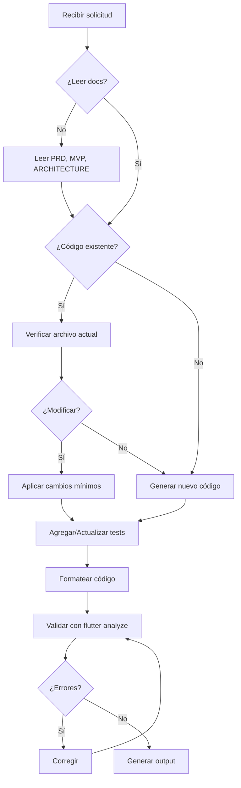
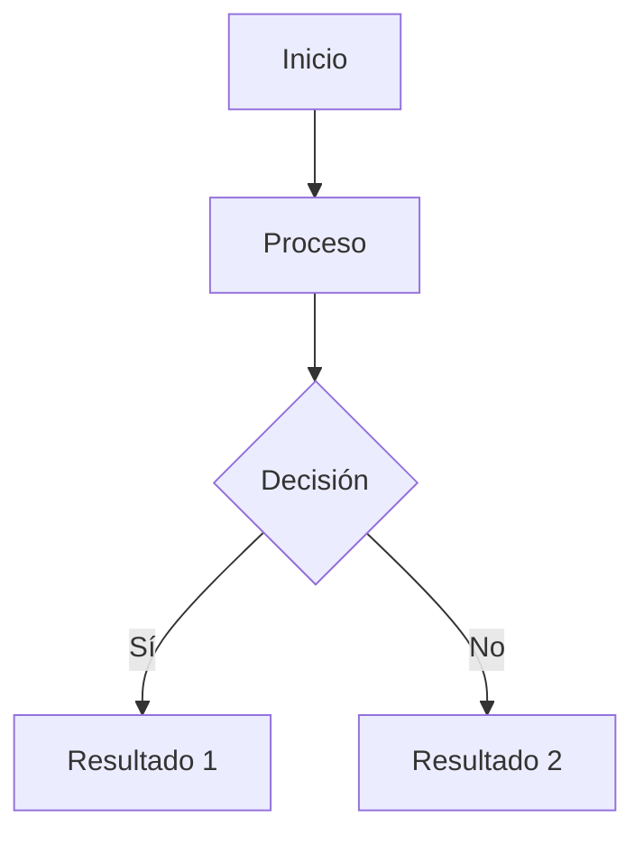

# 🤖 IA_RULES.md — Directrices para Agentes de Desarrollo IA

**Versión:** 1.1  
**Fecha:** 2025-11-13  
**Autor:** JuanPMorales  
**Propósito:** Definir reglas estrictas para IAs que generen, modifiquen o documenten código del proyecto Task Timer.

---

## 📑 Tabla de Contenidos

1. [Propósito](#1-propósito)
2. [Contexto del Proyecto](#2-contexto-del-proyecto)
3. [Documentos de Referencia Obligatorios](#3-documentos-de-referencia-obligatorios)
4. [Principios Técnicos](#4-principios-técnicos)
5. [Arquitectura y Estructura](#5-arquitectura-y-estructura)
6. [Estilo y Convenciones de Código](#6-estilo-y-convenciones-de-código)
7. [Testing y Calidad](#7-testing-y-calidad)
8. [Gestión de Dependencias](#8-gestión-de-dependencias)
9. [Comportamiento de la IA](#9-comportamiento-de-la-ia)
10. [Limitaciones de la IA](#10-limitaciones-de-la-ia)
11. [Formato de Salida Esperado](#11-formato-de-salida-esperado)
12. [Flujo de Trabajo](#12-flujo-de-trabajo)
13. [Manejo de Errores y Excepciones](#13-manejo-de-errores-y-excepciones)
14. [Seguridad y Privacidad](#14-seguridad-y-privacidad)
15. [Versionado y Commits](#15-versionado-y-commits)
16. [Git Flow - Flujo de Ramas](#16-git-flow---flujo-de-ramas)
17. [Preguntas Frecuentes](#17-preguntas-frecuentes)
18. [Mantenimiento](#18-mantenimiento)

---

## 1. Propósito

Estas reglas definen los principios que **toda inteligencia artificial** debe seguir al generar, modificar o documentar código del proyecto **Task Timer**.

**Objetivos:**
- ✅ Mantener consistencia arquitectónica
- ✅ Garantizar calidad de código
- ✅ Facilitar mantenibilidad
- ✅ Asegurar adherencia al PRD y MVP
- ✅ Reducir deuda técnica

---

## 2. Contexto del Proyecto

### 2.1 Información General

| Aspecto | Valor |
|---------|-------|
| **Nombre** | Task Timer |
| **Plataformas** | Android (8.0+) / iOS (15+) |
| **Framework** | Flutter 3.19+ |
| **Lenguaje** | Dart 3.3+ |
| **Arquitectura** | Clean Architecture + MVVM + Riverpod |
| **Persistencia** | SQLite (sqflite) |
| **Conectividad** | **Offline-first** (sin backend) |
| **Hardware** | Botones de volumen, vibración |

### 2.2 Características Clave

- **Timer basado en timestamps** (no Timer.periodic persistente)
- **Background support** (Foreground Service en Android)
- **Control físico** (Vol↑ = Start/Resume, Vol↓ = Pause)
- **Dark mode** por defecto (paleta azul #0A0E2A + #3BCDFE)
- **100% local** (sin analytics, sin tracking)

---

## 3. Documentos de Referencia Obligatorios

**CRÍTICO:** La IA **DEBE** leer estos documentos antes de generar código:

| Documento | Ruta | Propósito |
|-----------|------|-----------|
| **PRD** | `./task_timer_prd_v2.md` | Requerimientos del producto |
| **MVP Técnico** | `./task_timer_mvp_tecnico.md` | Alcance técnico del MVP |
| **Arquitectura** | `./ARCHITECTURE.md` | Diseño técnico detallado |
| **README** | `./README.md` | Instrucciones generales |
| **CHANGELOG** | `./CHANGELOG.md` | Historial de cambios |

### 3.1 Prioridad de Documentos

En caso de conflicto entre documentos:

```
ARCHITECTURE.md > MVP_TECNICO.md > PRD.md > README.md
```

**Ejemplo:** Si el PRD dice "usar Provider" pero ARCHITECTURE.md dice "usar Riverpod", seguir ARCHITECTURE.md.

---

## 4. Principios Técnicos

### 4.1 Principios SOLID

| Principio | Aplicación en Task Timer |
|-----------|--------------------------|
| **Single Responsibility** | Cada clase tiene una única razón de cambio |
| **Open/Closed** | Extender funcionalidad sin modificar código existente |
| **Liskov Substitution** | Subtipos deben ser intercambiables |
| **Interface Segregation** | Interfaces específicas, no genéricas |
| **Dependency Inversion** | Dependencias de abstracciones, no implementaciones |

### 4.2 Reglas de Arquitectura

#### ❌ Prohibido

```dart
// MAL: Presentation depende de Data directamente
class TimerScreen extends StatelessWidget {
  final DatabaseHelper _db = DatabaseHelper.instance; // ❌
}

// MAL: Domain depende de Framework
import 'package:flutter/material.dart'; // ❌ en domain/
class Task {
  final Color color; // ❌
}

// MAL: UI con lógica de negocio
class TaskListScreen extends StatelessWidget {
  void createTask() {
    final db = await openDatabase(...); // ❌
    await db.insert('tasks', ...);
  }
}
```

#### ✅ Correcto

```dart
// BIEN: Presentation depende de Domain
class TimerScreen extends ConsumerWidget {
  @override
  Widget build(BuildContext context, WidgetRef ref) {
    final timerNotifier = ref.watch(timerProvider.notifier); // ✅
    return ...;
  }
}

// BIEN: Domain sin dependencias externas
class Task {
  final String color; // ✅ String, no Color
}

// BIEN: UI delega a Provider → UseCase → Repository
class TaskListScreen extends ConsumerWidget {
  void createTask() {
    ref.read(taskProvider.notifier).createTask(...); // ✅
  }
}
```

### 4.3 Separación de Capas

**REGLA ESTRICTA:** Las capas solo pueden depender de capas inferiores o del mismo nivel.

```
┌─────────────┐
│ Presentation│  ← Puede usar Domain
└──────┬──────┘
       ↓
┌──────────────┐
│   Domain     │  ← NO puede usar Data ni Presentation
└──────┬───────┘
       ↓
┌──────────────┐
│    Data      │  ← Puede usar Domain
└──────────────┘
```

---

## 5. Arquitectura y Estructura

### 5.1 Estructura de Carpetas (OBLIGATORIA)

```
lib/
├── core/
│   ├── theme/
│   │   ├── colors.dart
│   │   └── text_styles.dart
│   ├── constants/
│   │   └── app_constants.dart
│   ├── utils/
│   │   ├── logger.dart
│   │   ├── validators.dart
│   │   └── performance_tracker.dart
│   └── providers/
│       └── providers.dart
│
├── data/
│   ├── models/
│   │   ├── task_model.dart
│   │   └── timer_session_model.dart
│   ├── repositories/
│   │   ├── task_repository_impl.dart
│   │   └── timer_repository_impl.dart
│   └── database/
│       ├── database_helper.dart
│       └── migrations.dart
│
├── domain/
│   ├── entities/
│   │   ├── task.dart
│   │   └── timer_session.dart
│   ├── repositories/
│   │   ├── task_repository.dart
│   │   └── timer_repository.dart
│   └── usecases/
│       ├── create_task.dart
│       ├── get_tasks.dart
│       ├── start_timer.dart
│       ├── pause_timer.dart
│       └── restore_timer.dart
│
├── presentation/
│   ├── providers/
│   │   ├── task_provider.dart
│   │   └── timer_provider.dart
│   ├── screens/
│   │   ├── task_list_screen.dart
│   │   └── timer_screen.dart
│   └── widgets/
│       ├── task_card.dart
│       ├── circular_progress.dart
│       └── new_task_modal.dart
│
├── services/
│   ├── volume_button_service.dart
│   ├── vibration_service.dart
│   └── background_service.dart
│
└── main.dart
```

### 5.2 Reglas de Naming

#### Archivos

```dart
// ✅ BIEN: snake_case para archivos
task_repository.dart
timer_provider.dart
create_task.dart

// ❌ MAL: PascalCase o camelCase
TaskRepository.dart  // ❌
timerProvider.dart   // ❌
```

#### Clases

```dart
// ✅ BIEN: PascalCase para clases
class TaskRepository { }
class TimerProvider { }
class CreateTaskUseCase { }

// ❌ MAL: snake_case o camelCase
class task_repository { } // ❌
class timerProvider { }   // ❌
```

#### Variables y Métodos

```dart
// ✅ BIEN: camelCase
final remainingSeconds = 60;
void startTimer() { }

// ❌ MAL: snake_case o PascalCase
final remaining_seconds = 60; // ❌
void StartTimer() { }         // ❌
```

#### Constantes

```dart
// ✅ BIEN: camelCase para constantes privadas
const _databaseVersion = 1;
const _cacheDuration = Duration(minutes: 5);

// ✅ BIEN: lowerCamelCase para constantes públicas
const defaultColor = '#3BCDFE';
const maxTaskNameLength = 50;

// ❌ MAL: SCREAMING_SNAKE_CASE (solo para enums)
const DATABASE_VERSION = 1; // ❌
```

#### Enums

```dart
// ✅ BIEN: PascalCase para enum, lowerCamelCase para valores
enum TimerStatus {
  stopped,
  running,
  paused,
  completed,
}

// ❌ MAL: SCREAMING_SNAKE_CASE
enum TimerStatus {
  STOPPED,  // ❌
  RUNNING,  // ❌
}
```

---

## 6. Estilo y Convenciones de Código

### 6.1 Formato

**REGLA:** Todo código debe pasar `flutter format` sin cambios.

```bash
# Antes de commit
flutter format lib/ test/

# Verificar (falla si hay cambios necesarios)
flutter format --set-exit-if-changed lib/ test/
```

### 6.2 Imports

**Orden de imports:**

```dart
// 1. Dart SDK
import 'dart:async';
import 'dart:io';

// 2. Paquetes externos (Flutter, packages)
import 'package:flutter/material.dart';
import 'package:flutter_riverpod/flutter_riverpod.dart';

// 3. Imports del proyecto (absolutos)
import 'package:task_timer/core/utils/logger.dart';
import 'package:task_timer/domain/entities/task.dart';

// 4. Imports relativos (solo si es necesario)
import '../widgets/task_card.dart';
```

**PROHIBIDO:** Mezclar imports absolutos y relativos sin razón.

### 6.3 Documentación

**OBLIGATORIO:** Documentar todas las clases, métodos y funciones públicas.

```dart
/// Repositorio para gestionar las operaciones CRUD de tareas.
///
/// Implementa [TaskRepository] y usa SQLite como fuente de datos.
/// Incluye caché en memoria para optimizar lecturas frecuentes.
///
/// Ejemplo de uso:
/// ```dart
/// final repo = TaskRepositoryImpl(DatabaseHelper.instance);
/// final tasks = await repo.getAll();
/// ```
class TaskRepositoryImpl implements TaskRepository {
  /// Crea una nueva tarea en la base de datos.
  ///
  /// Lanza [ValidationException] si los datos son inválidos.
  /// Lanza [DatabaseException] si hay error de persistencia.
  ///
  /// Parámetros:
  /// - [task]: La tarea a crear (debe tener ID único)
  @override
  Future<void> create(Task task) async {
    // Implementación...
  }
}
```

### 6.4 Comentarios

```dart
// ✅ BIEN: Comentarios explicativos cuando necesario
// Calcular tiempo transcurrido usando timestamps absolutos
// para robustez frente a kills de proceso
final elapsed = DateTime.now().difference(startTime).inSeconds;

// ❌ MAL: Comentarios obvios
// Incrementar contador
counter++; // ❌

// ❌ MAL: Código comentado (usar git history)
// final oldLogic = someOldCode(); // ❌
```

### 6.5 Longitud de Línea

**REGLA:** Máximo 80 caracteres por línea (Flutter estándar).

```dart
// ✅ BIEN
final task = Task(
  id: uuid.v4(),
  name: name,
  durationSeconds: duration,
);

// ❌ MAL: Línea muy larga
final task = Task(id: uuid.v4(), name: name, durationSeconds: duration, color: color, createdAt: DateTime.now());
```

---

## 7. Testing y Calidad

### 7.1 Cobertura Mínima

**OBLIGATORIO:** Cobertura ≥70% en el MVP.

| Tipo de Test | Cobertura Mínima | Ubicación |
|--------------|------------------|-----------|
| **Unit Tests** | 80% | `test/` |
| **Widget Tests** | 60% | `test/` |
| **Integration Tests** | 50% | `integration_test/` |

### 7.2 Estructura de Tests

```
test/
├── core/
│   └── utils/
│       └── validators_test.dart
├── data/
│   └── repositories/
│       └── task_repository_test.dart
├── domain/
│   └── usecases/
│       └── create_task_test.dart
├── presentation/
│   └── providers/
│       └── task_provider_test.dart
└── helpers/
    └── task_builder.dart

integration_test/
└── app_test.dart
```

### 7.3 Naming de Tests

```dart
// ✅ BIEN: Descripción clara de lo que se prueba
test('createTask lanza ValidationException si nombre está vacío', () { });
test('getAll retorna lista ordenada por created_at DESC', () { });
test('Timer decrementa cada segundo correctamente', () { });

// ❌ MAL: Descripciones vagas
test('test 1', () { }); // ❌
test('funciona', () { }); // ❌
```

### 7.4 Arrange-Act-Assert

```dart
test('createTask guarda correctamente en DB', () async {
  // Arrange (preparar)
  final mockDb = MockDatabaseHelper();
  final repository = TaskRepositoryImpl(mockDb);
  final task = TaskBuilder().build();
  
  when(mockDb.insert(any, any)).thenAnswer((_) async => 1);
  
  // Act (ejecutar)
  await repository.create(task);
  
  // Assert (verificar)
  verify(mockDb.insert('tasks', any)).called(1);
});
```

### 7.5 Tests Obligatorios por Sprint

**Sprint 2 (DB + CRUD):**
- [ ] `TaskRepository.create()` con datos válidos
- [ ] `TaskRepository.create()` con nombre vacío (lanza excepción)
- [ ] `TaskRepository.getAll()` retorna lista ordenada
- [ ] `TaskRepository.update()` modifica correctamente
- [ ] `TaskRepository.delete()` elimina de DB

**Sprint 3 (Timer):**
- [ ] `TimerProvider.start()` crea sesión en DB
- [ ] `TimerProvider._startTicker()` decrementa cada segundo
- [ ] `TimerProvider.pause()` guarda progreso
- [ ] `TimerProvider.restore()` calcula tiempo correcto

**Sprint 5 (Background):**
- [ ] Integration test: cerrar app → reabrir → timer se restaura
- [ ] Timer basado en timestamps es inmune a cambios de hora del sistema

---

## 8. Gestión de Dependencias

### 8.1 Dependencias Permitidas

**SOLO las listadas en el PRD y MVP:**

```yaml
dependencies:
  flutter:
    sdk: flutter
  flutter_riverpod: ^2.4.10
  sqflite: ^2.3.2
  path_provider: ^2.1.2
  path: ^1.8.3
  volume_controller: ^2.0.7
  vibration: ^1.8.4
  intl: ^0.19.0
  uuid: ^4.3.3

dev_dependencies:
  flutter_test:
    sdk: flutter
  flutter_lints: ^3.0.1
  mockito: ^5.4.4
  build_runner: ^2.4.8
```

### 8.2 Prohibido Agregar Sin Aprobación

❌ **NO agregar:**
- `provider` (usar Riverpod)
- `bloc` / `flutter_bloc` (usar Riverpod)
- `get_it` (usar Riverpod providers)
- `hive` / `shared_preferences` (usar SQLite)
- `firebase_*` (MVP es offline)
- `dio` / `http` (no hay backend)

### 8.3 Proceso para Nueva Dependencia

Si la IA detecta necesidad de nueva dependencia:

1. **Pausar generación de código**
2. **Crear issue en GitHub:**
   ```markdown
   ## Nueva Dependencia Propuesta
   
   **Paquete:** `package_name`
   **Versión:** `^X.Y.Z`
   **Razón:** [Explicar por qué es necesaria]
   **Alternativas evaluadas:** [Listar alternativas consideradas]
   **Impacto:** [En tamaño de APK, performance, etc.]
   ```
3. **Esperar aprobación del Product Owner**

---

## 9. Comportamiento de la IA

### 9.1 Flujo de Trabajo



### 9.2 Antes de Generar Código

**CHECKLIST OBLIGATORIO:**

- [ ] Leí `ARCHITECTURE.md`
- [ ] Leí `MVP_TECNICO.md`
- [ ] Verifiqué que el módulo no existe
- [ ] Identifiqué la capa correcta (presentation/domain/data)
- [ ] Verifiqué dependencias permitidas
- [ ] Planifiqué los tests necesarios

### 9.3 Preguntas Antes de Actuar

Si hay **ambigüedad**, la IA debe preguntar:

```markdown
## ⚠️ Necesito Aclaración

**Contexto:** Estoy generando `XYZ`

**Pregunta:** ¿Debo usar [opción A] o [opción B]?

**Opciones:**
1. **Opción A:** [Descripción + pros/cons]
2. **Opción B:** [Descripción + pros/cons]

**Recomendación:** Opción A porque [razón]
```

### 9.4 Modificación de Código Existente

**REGLA:** Aplicar cambios mínimos, no reescribir todo.

```dart
// ❌ MAL: Reescribir método completo
// Antes:
void createTask(String name, int duration) {
  final task = Task(name: name, duration: duration);
  _repository.create(task);
}

// IA reescribe todo: ❌
Future<void> createTask(String name, int duration, String color) async {
  // Cambió toda la firma y agregó async innecesariamente
}

// ✅ BIEN: Cambio mínimo
// Antes:
void createTask(String name, int duration) {
  final task = Task(name: name, duration: duration);
  _repository.create(task);
}

// IA agrega solo el parámetro: ✅
void createTask(String name, int duration, String color) {
  final task = Task(name: name, duration: duration, color: color);
  _repository.create(task);
}
```

### 9.5 Registro de Decisiones

Si la IA toma una decisión técnica importante, debe **documentarla**:

```markdown
// lib/data/repositories/task_repository_impl.dart

/// Implementación del repositorio de tareas con SQLite.
///
/// **Decisión Técnica:** Se usa caché en memoria con TTL de 5 minutos
/// para reducir queries repetitivos. Justificación: En pruebas de
/// performance, las queries tomaban 150ms con 100 tareas, afectando
/// la fluidez del scroll. Con caché, se redujo a <10ms.
///
/// Fecha: 2025-11-11
/// Issue: #42
class TaskRepositoryImpl implements TaskRepository {
  // ...
}
```

### 9.6 Control de Versiones - Commits Obligatorios

**REGLA CRÍTICA:** Después de completar cada tarea del TASK_BREAKDOWN.md, la IA **DEBE** realizar commits siguiendo el workflow de Git profesional.

**🚨 IMPORTANTE - NUNCA OLVIDAR:**
1. ✅ **CADA TAREA = UNA RAMA FEATURE/** - Sin excepción
2. ✅ **SIEMPRE crear archivo `docs/progress/<id>_<nombre>.md`** con checklist completo Y formulario de PR
3. ✅ **NUNCA commitear directamente a `develop`** sin rama feature
4. ✅ **SIEMPRE validar con `flutter analyze`** antes de commit
5. ✅ **EL FORMULARIO DE PR ES OBLIGATORIO** - Debe incluirse AL FINAL de cada archivo de progreso

#### 9.6.1 Flujo Obligatorio por Tarea

```bash
# === PASO 1: Crear rama feature (OBLIGATORIO - NO OMITIR) ===
git checkout develop
git pull origin develop
git checkout -b feature/<nombre-descriptivo>

# Verificar que estás en la rama correcta
git branch  # Debe mostrar * feature/<nombre>

# === PASO 2: Implementar la tarea ===
# [Código generado por la IA]

# === PASO 3: Validar código (OBLIGATORIO) ===
flutter analyze    # Debe pasar sin errores
flutter test       # Todos los tests deben pasar (si hay tests)
dart format .      # Formatear código

# === PASO 4: Crear documentación (OBLIGATORIO) ===
# Crear docs/progress/<id>_<nombre>.md con checklist completo
# Actualizar docs/TASK_BREAKDOWN.md (marcar tarea como completada)

# === PASO 5: Hacer commit con Conventional Commits ===
git add .
git commit -m "<type>(<scope>): <description>

<body opcional explicando los cambios>

Refs: TASK_BREAKDOWN.md#<id-tarea>"

# === PASO 6: Push a la rama feature ===
git push -u origin feature/<nombre-descriptivo>

# === PASO 7: Informar al usuario ===
# Mostrar mensaje con instrucciones para crear PR o mergear
```

#### 9.6.2 Cuándo Hacer Commits

La IA debe hacer commit en los siguientes casos:

| Situación | Acción | Tipo de Commit |
|-----------|--------|----------------|
| ✅ Tarea completada | Commit obligatorio | `feat`, `fix`, `refactor`, etc. |
| ✅ Documentación creada | Commit obligatorio | `docs` |
| ✅ Tests agregados/modificados | Commit obligatorio | `test` |
| ✅ Múltiples archivos relacionados | Commit único atómico | Según el cambio principal |
| ❌ Código incompleto | NO hacer commit | - |
| ❌ Tests fallando | NO hacer commit | - |
| ❌ Errores de análisis | NO hacer commit | - |

#### 9.6.3 Formato de Commits de la IA

**Template obligatorio:**

```bash
<type>(<scope>): <short description>

<optional body explaining:
- What was implemented
- Why it was implemented this way
- Any important decisions made>

<optional footer:
Refs: TASK_BREAKDOWN.md#<task-id>
Closes: #<issue-number> (si aplica)>
```

**Ejemplo real:**

```bash
feat(riverpod): configure ProviderScope in main.dart

Completa tarea 2.2.1 del TASK_BREAKDOWN.md

- Importa flutter_riverpod en main.dart
- Envuelve TaskTimerApp con ProviderScope
- Habilita gestión de estado reactivo global
- Valida con flutter analyze sin errores

Refs: TASK_BREAKDOWN.md#2.2.1
```

#### 9.6.4 Sugerencia de Commits al Usuario

Al finalizar una tarea, la IA debe mostrar:

```markdown
## ✅ Tarea Completada: <nombre-tarea>

**Archivos modificados:**
- `path/to/file1.dart`
- `path/to/file2.dart`

**Comando Git sugerido:**

\`\`\`bash
git add .
git commit -m "feat(core): configure Riverpod ProviderScope

Completa tarea 2.2.1 del TASK_BREAKDOWN.md

- Importa flutter_riverpod en main.dart
- Envuelve app con ProviderScope
- Habilita gestión de estado global

Refs: TASK_BREAKDOWN.md#2.2.1"
\`\`\`

**¿Deseas que ejecute este commit ahora? (Sí/No)**
```

#### 9.6.5 Ejecución Automática de Commits

Si el usuario responde "Sí" o si está configurado el modo automático:

```bash
# La IA ejecuta:
git add .
git status  # Mostrar archivos añadidos
git commit -m "<mensaje-generado>"
git log -1 --oneline  # Confirmar commit exitoso
```

#### 9.6.6 Validaciones Previas al Commit

**OBLIGATORIO antes de commit:**

```bash
# 1. Análisis de código
flutter analyze
# Resultado esperado: "No issues found!"

# 2. Tests (si existen para esta tarea)
flutter test
# Resultado esperado: "All tests passed!"

# 3. Formato
flutter format lib/ test/
# Resultado esperado: Sin cambios pendientes
```

Si alguna validación falla, la IA debe:
1. Corregir los errores automáticamente
2. Volver a validar
3. Solo entonces hacer el commit

#### 9.6.7 Actualización de Documentación en el Commit

Cada commit debe incluir:

1. **Actualización de TASK_BREAKDOWN.md:**
   ```markdown
   | 2.2.1 | Configurar ProviderScope | ✅ Completada | 1.1.8, 2.1.6 |
   ```

2. **Creación de archivo de progreso (CON FORMULARIO DE PR OBLIGATORIO):**
   ```markdown
   docs/progress/<id>_<nombre>.md
   
   # Contenido del archivo de progreso
   
   [... contenido normal del progreso ...]
   
   ---
   
   ## 📋 Formulario para Pull Request
   
   ## 📝 Descripción
   [Descripción clara y concisa de los cambios]
   
   ## 🎯 Tipo de Cambio
   - [x] ✨ Nueva feature (cambio no-breaking que añade funcionalidad)
   [... resto del formulario completo ...]
   
   ## 🎉 Ready for Review
   - [x] Este PR está listo para ser revisado
   ```

3. **Ambos archivos en el mismo commit:**
   ```bash
   git add docs/TASK_BREAKDOWN.md
   git add docs/progress/2.2.1_riverpod_configuracion.md
   git add lib/main.dart
   git commit -m "feat(riverpod): configure ProviderScope..."
   ```

#### 9.6.8 Formulario de Pull Request - OBLIGATORIO EN TODOS LOS ARCHIVOS DE PROGRESO

**🚨 REGLA CRÍTICA:** Todo archivo `docs/progress/<id>_<nombre>.md` **DEBE** incluir el formulario completo de PR al final.

**Template del Formulario (COPIAR COMPLETO):**

```markdown
---

## 📋 Formulario para Pull Request

## 📝 Descripción

[Descripción clara y concisa de los cambios implementados]

**Cambios principales:**
- [Lista de cambios clave]
- [Archivos creados/modificados]
- [Validaciones realizadas]

## 🎯 Tipo de Cambio

- [ ] 🐛 Bug fix (cambio no-breaking que corrige un issue)
- [ ] ✨ Nueva feature (cambio no-breaking que añade funcionalidad)
- [ ] 💥 Breaking change (fix o feature que causa cambios incompatibles)
- [ ] 📚 Documentación
- [ ] 🎨 Estilo/Formateo
- [ ] ♻️ Refactorización
- [ ] ⚡ Mejora de performance
- [ ] ✅ Tests
- [ ] 🔧 Configuración/Build

## 🔗 Issues Relacionados

- Related to tarea <id> en TASK_BREAKDOWN.md
- Depende de: [tareas previas]
- Será utilizado por: [tareas futuras]

## 🧪 Testing

### Tests Ejecutados

- [ ] `flutter analyze` - [resultado]
- [ ] `dart format` - [resultado]
- [ ] Unit tests (pendiente/completado)
- [ ] Widget tests (pendiente/completado)
- [ ] Integration tests (pendiente/completado)
- [ ] Tests manuales en dispositivo

### Plataformas Probadas

- [ ] Android
- [ ] iOS
- [ ] Web
- [ ] Windows Desktop

### Dispositivos/Versiones de Prueba

[Describir dispositivos usados o indicar "Pendiente"]

## 📸 Screenshots/Videos

[Agregar screenshots si aplica, o indicar "No aplica"]

## ✅ Checklist

### Código

- [ ] Mi código sigue las convenciones del proyecto
- [ ] He realizado self-review de mi código
- [ ] He comentado código complejo o no-obvio
- [ ] He actualizado la documentación relevante (TASK_BREAKDOWN.md)
- [ ] Mis cambios no generan nuevos warnings
- [ ] He añadido tests que prueban mi fix/feature
- [ ] Tests nuevos y existentes pasan localmente

### Commits

- [ ] Mis commits siguen Conventional Commits
- [ ] He hecho commits atómicos (1 feature/fix = 1 commit)
- [ ] Mensajes de commit son descriptivos

### Documentación

- [ ] He actualizado README.md (si aplica)
- [ ] He actualizado CHANGELOG.md (pendiente)
- [ ] He actualizado documentación técnica (TASK_BREAKDOWN.md)

### Tests y Calidad

- [ ] `flutter analyze` pasa sin errores
- [ ] `flutter test` pasa sin fallos
- [ ] Cobertura de tests ≥ 90% en código nuevo
- [ ] `flutter format` aplicado

### GitFlow

- [ ] PR se crea desde rama correcta (feature/* → develop)
- [ ] Rama está actualizada con develop
- [ ] No hay conflictos de merge

## 📊 Impacto en Performance

- Build size: [sin cambios / +XKB / -XKB]
- Consumo de RAM: [sin cambios / +XMB]
- Consumo de batería: [sin impacto / mejora X%]
- Tiempo de compilación: [insignificante / +Xs]

## 🔄 Plan de Rollback

```bash
git revert <commit-hash>
# o
git checkout develop
git reset --hard HEAD~1
```

[Explicar si el rollback es seguro y por qué]

## 📝 Notas Adicionales

**Características destacadas:**
1. [Característica 1]
2. [Característica 2]

**Uso futuro:**
[Cómo se usará este código en el futuro]

---

## 👀 Reviewers

@JuanPMorales

## 🎉 Ready for Review

- [x] Este PR está listo para ser revisado
```

**❌ NUNCA omitir este formulario**
**✅ Adaptar el contenido a cada tarea específica**
**✅ Marcar todos los checkboxes aplicables con [x]**

#### 9.6.9 Mensaje al Usuario Después del Commit

```markdown
✅ **Commit realizado exitosamente**

**Commit hash:** `abc1234`
**Rama:** `feature/configure-riverpod`
**Archivos:** 3 archivos modificados

**📋 Formulario de PR incluido:** ✅ docs/progress/2.2.1_riverpod_configuracion.md

**Próximos pasos:**
1. Revisar cambios: `git show abc1234`
2. Push a remoto: `git push origin feature/configure-riverpod`
3. **Crear Pull Request en GitHub** usando el formulario del archivo de progreso
4. Continuar con siguiente tarea: 2.2.2

**Nota:** Recuerda hacer push antes de cambiar de rama.
```

---

## 10. Limitaciones de la IA

### 10.1 Prohibiciones Absolutas

❌ **La IA NO puede:**

1. **Modificar archivos del sistema** sin aprobación explícita:
   - `README.md`
   - `LICENSE`
   - `.github/workflows/*`
   - `pubspec.yaml` (excepto comentarios)
   - `.gitignore`

2. **Acceder a servicios externos:**
   - APIs HTTP/REST
   - Firebase
   - Analytics
   - Crashlytics (en MVP)

3. **Generar contenido no técnico:**
   - Marketing
   - Comunicados de prensa
   - Emails a usuarios

4. **Exponer datos personales:**
   - No hardcodear nombres, emails, teléfonos
   - No incluir tokens o API keys

5. **Crear lógica fuera del alcance del MVP:**
   - Sincronización en la nube
   - Estadísticas avanzadas
   - Modo Pomodoro automático
   - Widgets de pantalla de inicio

### 10.2 Warnings Obligatorios

Si el usuario solicita algo fuera del alcance:

```markdown
⚠️ **Advertencia:** Esta funcionalidad está marcada como "Fuera del Alcance del MVP" en el PRD.

**Solicitado:** [Descripción]
**Roadmap:** Planificado para v1.5 (3-4 meses post-lanzamiento)

**Opciones:**
1. Continuar de todos modos (no recomendado)
2. Crear issue para v1.5
3. Cancelar solicitud

¿Cómo deseas proceder?
```

---

## 11. Formato de Salida Esperado

### 11.1 Archivos Dart

```dart
// ✅ Formato correcto

// 1. Header con copyright (opcional)
// Copyright (c) 2025 JuanPMorales. MIT License.

// 2. Imports ordenados
import 'dart:async';

import 'package:flutter/material.dart';
import 'package:flutter_riverpod/flutter_riverpod.dart';

import 'package:task_timer/domain/entities/task.dart';

// 3. Documentación de clase
/// Descripción de la clase.
class MyClass {
  // 4. Constantes privadas
  static const _constantName = 'value';
  
  // 5. Campos privados
  final String _fieldName;
  
  // 6. Constructor
  const MyClass(this._fieldName);
  
  // 7. Métodos públicos
  void publicMethod() { }
  
  // 8. Métodos privados
  void _privateMethod() { }
}
```

### 11.2 Archivos Markdown

```markdown
# Título Principal

**Metadatos:**
- Fecha: YYYY-MM-DD
- Autor: Nombre

## Sección

### Subsección

Párrafo con **negrita** y *cursiva*.

#### Lista

- Punto 1
- Punto 2
  - Sub-punto

#### Código

```dart
final example = 'code';
```

#### Tabla

| Columna 1 | Columna 2 |
|-----------|-----------|
| Valor 1   | Valor 2   |
```

### 11.3 Diagramos Mermaid

```markdown

```

---

## 12. Flujo de Trabajo

### 12.1 Generar Nuevo Módulo

**Ejemplo: Crear `UpdateTaskUseCase`**

**Paso 1:** Verificar documentación
```markdown
- ✅ Leído ARCHITECTURE.md sección 4.2.2 (UseCases)
- ✅ Verificado que UpdateTaskUseCase no existe
- ✅ Identificado que va en `lib/domain/usecases/update_task.dart`
```

**Paso 2:** Generar código

```dart
// lib/domain/usecases/update_task.dart

import 'package:task_timer/core/utils/logger.dart';
import 'package:task_timer/core/utils/validators.dart';
import 'package:task_timer/domain/entities/task.dart';
import 'package:task_timer/domain/repositories/task_repository.dart';

/// Use case para actualizar una tarea existente.
///
/// Valida los datos antes de persistir y actualiza el campo `updatedAt`.
class UpdateTaskUseCase {
  final TaskRepository _repository;
  
  const UpdateTaskUseCase(this._repository);
  
  /// Ejecuta la actualización de la tarea.
  ///
  /// Lanza [ValidationException] si los datos son inválidos.
  /// Lanza [DatabaseException] si hay error de persistencia.
  Future<void> execute(Task task) async {
    // Validar nombre
    final nameError = TaskValidators.validateName(task.name);
    if (nameError != null) {
      throw ValidationException(nameError);
    }
    
    // Validar duración
    final durationError = TaskValidators.validateDuration(task.durationSeconds);
    if (durationError != null) {
      throw ValidationException(durationError);
    }
    
    // Actualizar timestamp
    final updatedTask = task.copyWith(updatedAt: DateTime.now());
    
    // Persistir
    await _repository.update(updatedTask);
    
    Logger.i('Task updated: ${task.id}');
  }
}
```

**Paso 3:** Generar tests

```dart
// test/domain/usecases/update_task_test.dart

import 'package:flutter_test/flutter_test.dart';
import 'package:mockito/mockito.dart';
import 'package:task_timer/domain/usecases/update_task.dart';

import '../../helpers/task_builder.dart';
import '../../mocks.mocks.dart';

void main() {
  late UpdateTaskUseCase useCase;
  late MockTaskRepository mockRepository;
  
  setUp(() {
    mockRepository = MockTaskRepository();
    useCase = UpdateTaskUseCase(mockRepository);
  });
  
  group('UpdateTaskUseCase -', () {
    test('actualiza tarea correctamente', () async {
      // Arrange
      final task = TaskBuilder().build();
      when(mockRepository.update(any)).thenAnswer((_) async => {});
      
      // Act
      await useCase.execute(task);
      
      // Assert
      verify(mockRepository.update(any)).called(1);
    });
    
    test('lanza ValidationException si nombre vacío', () async {
      // Arrange
      final task = TaskBuilder().withName('').build();
      
      // Act & Assert
      expect(
        () => useCase.execute(task),
        throwsA(isA<ValidationException>()),
      );
    });
  });
}
```

**Paso 4:** Actualizar provider (si necesario)

```dart
// lib/core/providers/providers.dart

final updateTaskUseCaseProvider = Provider<UpdateTaskUseCase>((ref) {
  return UpdateTaskUseCase(ref.watch(taskRepositoryProvider));
});
```

**Paso 5:** Documentar

```markdown
## Changelog

### 2025-11-11
- Agregado `UpdateTaskUseCase` para actualizar tareas
- Tests unitarios con cobertura 100%
- Integrado en `TaskProvider`
```

### 12.2 Modificar Módulo Existente

**Ejemplo: Agregar campo `tags` a Task**

**Paso 1:** Evaluar impacto

```markdown
## Análisis de Impacto

**Cambio:** Agregar campo `tags: List<String>` a `Task`

**Archivos afectados:**
- `lib/domain/entities/task.dart` (entity)
- `lib/data/models/task_model.dart` (model)
- `lib/data/database/database_helper.dart` (migración v1 → v2)
- `test/domain/entities/task_test.dart` (tests)
- `test/data/models/task_model_test.dart` (tests)

**Riesgo:** Medio (requiere migración de DB)
```

**Paso 2:** Aplicar cambios

```dart
// 1. Entidad
class Task {
  final String id;
  final String name;
  final List<String> tags; // ← Nuevo campo
  
  const Task({
    required this.id,
    required this.name,
    this.tags = const [], // ← Default vacío
  });
}

// 2. Model
class TaskModel {
  final String tags; // ← JSON string
  
  Task toEntity() {
    return Task(
      id: id,
      name: name,
      tags: tags.isEmpty ? [] : tags.split(','), // ← Parsear
    );
  }
}

// 3. Migración
Future<void> _migrateToV2(Database db) async {
  await db.execute('ALTER TABLE tasks ADD COLUMN tags TEXT DEFAULT ""');
}
```

**Paso 3:** Actualizar tests

```dart
test('Task con tags se serializa correctamente', () {
  final task = Task(
    id: '123',
    name: 'Test',
    tags: ['work', 'urgent'],
  );
  
  final model = TaskModel.fromEntity(task);
  expect(model.tags, 'work,urgent');
});
```

---

## 13. Manejo de Errores y Excepciones

### 13.1 Jerarquía de Excepciones

```dart
// lib/core/exceptions/exceptions.dart

/// Excepción base de la aplicación
abstract class AppException implements Exception {
  final String message;
  final Object? cause;
  
  const AppException(this.message, [this.cause]);
  
  @override
  String toString() => 'AppException: $message';
}

/// Errores de validación de input
class ValidationException extends AppException {
  const ValidationException(super.message);
}

/// Errores de base de datos
class DatabaseException extends AppException {
  const DatabaseException(super.message, [super.cause]);
}

/// Errores de plataforma (permisos, hardware)
class PlatformException extends AppException {
  const PlatformException(super.message, [super.cause]);
}
```

### 13.2 Try-Catch Pattern

```dart
// ✅ BIEN: Capturar específico, loggear, re-lanzar typed exception
Future<void> create(Task task) async {
  try {
    final db = await _db.database;
    await db.insert('tasks', task.toMap());
  } on SqliteException catch (e) {
    Logger.e('SQLite error', e);
    throw DatabaseException('Error al guardar tarea', e);
  } catch (e, stackTrace) {
    Logger.critical('Unexpected error', e, stackTrace);
    throw DatabaseException('Error inesperado', e);
  }
}

// ❌ MAL: Catch genérico sin re-lanzar
Future<void> create(Task task) async {
  try {
    // ...
  } catch (e) {
    print('Error: $e'); // ❌ No usar print
    // ❌ No re-lanza, silencia el error
  }
}
```

### 13.3 Error Handling en UI

```dart
// lib/presentation/screens/task_list_screen.dart

class TaskListScreen extends ConsumerWidget {
  @override
  Widget build(BuildContext context, WidgetRef ref) {
    final state = ref.watch(taskProvider);
    
    // Mostrar error si existe
    if (state.error != null) {
      return Center(
        child: Column(
          mainAxisAlignment: MainAxisAlignment.center,
          children: [
            Icon(Icons.error_outline, size: 48, color: Colors.red),
            SizedBox(height: 16),
            Text(state.error!),
            SizedBox(height: 16),
            ElevatedButton(
              onPressed: () => ref.read(taskProvider.notifier).loadTasks(),
              child: Text('Reintentar'),
            ),
          ],
        ),
      );
    }
    
    // ...
  }
}
```

---

## 14. Seguridad y Privacidad

### 14.1 Datos Sensibles

**PROHIBIDO hardcodear:**

```dart
// ❌ MAL
const apiKey = 'sk-1234567890abcdef'; // ❌
const userEmail = 'juan@example.com'; // ❌
const databasePassword = 'password123'; // ❌
```

### 14.2 SQL Injection Prevention

```dart
// ✅ BIEN: Usar placeholders
await db.query(
  'tasks',
  where: 'id = ?',
  whereArgs: [taskId], // ← Safe
);

// ❌ MAL: Concatenación de strings
await db.rawQuery('SELECT * FROM tasks WHERE id = "$taskId"'); // ❌ Vulnerable
```

### 14.3 Input Sanitization

```dart
// lib/core/utils/validators.dart

class TaskValidators {
  static String sanitizeName(String input) {
    // Remover caracteres peligrosos
    return input
        .replaceAll(RegExp(r'[^\w\s\-áéíóúñÁÉÍÓÚÑ]'), '')
        .trim()
        .substring(0, min(input.length, 50));
  }
  
  static String? validateName(String? value) {
    if (value == null || value.trim().isEmpty) {
      return 'El nombre no puede estar vacío';
    }
    
    final sanitized = sanitizeName(value);
    if (sanitized != value) {
      return 'El nombre contiene caracteres no válidos';
    }
    
    return null;
  }
}
```

---

## 15. Versionado y Commits

### 15.1 Conventional Commits

**Formato:**

```
<type>(<scope>): <description>

[optional body]

[optional footer]
```

**Tipos permitidos:**

| Tipo | Uso |
|------|-----|
| `feat` | Nueva funcionalidad |
| `fix` | Corrección de bug |
| `docs` | Cambios en documentación |
| `style` | Formato (no afecta lógica) |
| `refactor` | Refactorización (no cambia comportamiento) |
| `test` | Agregar o modificar tests |
| `chore` | Mantenimiento (deps, config) |
| `perf` | Mejora de performance |

**Ejemplos:**

```bash
# ✅ BIEN
feat(timer): agregar soporte para pausar con Vol↓
fix(db): corregir migración v1→v2 fallando en Android 8
docs(readme): actualizar instrucciones de instalación
test(repository): agregar tests para TaskRepository.update()
refactor(providers): extraer lógica común a base class

# ❌ MAL
update stuff  # ❌ Vago
fixed bug     # ❌ No especifica qué bug
WIP           # ❌ Work In Progress no debe commitearse
```

### 15.2 Commits de la IA

Cuando la IA genera código, debe sugerir el commit message:

```markdown
## 📝 Código Generado

**Archivos creados:**
- `lib/domain/usecases/update_task.dart`
- `test/domain/usecases/update_task_test.dart`

**Archivos modificados:**
- `lib/core/providers/providers.dart`

**Commit sugerido:**
```bash
feat(usecases): agregar UpdateTaskUseCase

- Implementado use case para actualizar tareas
- Validaciones de nombre y duración
- Tests unitarios con cobertura 100%
- Integrado en TaskProvider
```
```

### 15.3 Workflow Profesional - Feature Branch por Tarea

**REGLA CRÍTICA:** Cada tarea del TASK_BREAKDOWN.md debe completarse en una rama `feature/*` independiente siguiendo [Conventional Commits v1.0.0](https://www.conventionalcommits.org/en/v1.0.0/).

#### 15.3.1 Flujo Completo (Una Tarea a la Vez)

```bash
# === PASO 1: Preparar rama feature ===
git checkout develop
git pull origin develop
git checkout -b feature/<nombre-descriptivo-tarea>

# Ejemplo para tarea 2.1.7:
git checkout -b feature/documentar-arquitectura

# === PASO 2: Implementar UNA SOLA tarea ===
# - Escribir código según especificaciones
# - Seguir principios de Clean Architecture
# - Documentar con DartDoc
# - Respetar convenciones de naming

# === PASO 3: Validar código ===
flutter analyze                    # Debe retornar 0 errores
flutter test                       # Todos los tests deben pasar
flutter format lib/ test/          # Formatear código

# === PASO 4: Crear documentación de progreso ===
# Crear archivo: docs/progress/<id>_<nombre>.md
# Ejemplo: docs/progress/2.1.7_documentar_arquitectura.md
# Incluir:
# - Resumen de lo implementado
# - Archivos creados/modificados
# - Decisiones técnicas
# - Validaciones realizadas
# - Próximos pasos

# === PASO 5: Actualizar TASK_BREAKDOWN.md ===
# Cambiar estado de tarea a: ✅ Completada

# === PASO 6: Commit con Conventional Commits ===
git add .
git commit -m "feat(core): document Clean Architecture design

Completa tarea 2.1.7 del TASK_BREAKDOWN.md

- Agrega diagramas de capas (Domain, Data, Presentation)
- Documenta flujo de datos con Riverpod
- Incluye ejemplos de dependencias entre capas
- Actualiza ARCHITECTURE.md con secciones completas

Refs: TASK_BREAKDOWN.md#2.1.7"

# === PASO 7: Push a feature branch ===
git push -u origin feature/documentar-arquitectura

# === PASO 8: Crear Pull Request ===
# En GitHub:
# - Base: develop
# - Compare: feature/documentar-arquitectura
# - Título: "feat(core): document Clean Architecture design"
# - Descripción: Copiar cuerpo del commit
# - Labels: documentation, task-2.1.7
# - Assignee: Desarrollador

# === PASO 9: Code Review y Merge ===
# - CI/CD debe pasar (tests, lint)
# - Revisión de código (opcional si es individual)
# - Mergear con "Squash and merge"
# - Eliminar rama feature después de merge

# === PASO 10: Actualizar local y siguiente tarea ===
git checkout develop
git pull origin develop
# Repetir desde PASO 1 para la siguiente tarea
```

#### 15.3.2 Naming de Feature Branches

**Formato:** `feature/<nombre-kebab-case>`

```bash
# ✅ BIEN - Descriptivos y concisos
feature/task-creation-modal
feature/timer-background-service
feature/volume-button-control
feature/documentar-arquitectura
feature/configure-riverpod

# ❌ MAL - Demasiado genéricos o incorrectos
feature/new-stuff              # ❌ Vago
feature_timer                  # ❌ Guion bajo
FEATURE/timer                  # ❌ Mayúsculas
timer-feature                  # ❌ Orden invertido
feature/2.1.7                  # ❌ Solo número de tarea
```

#### 15.3.3 Formato de Commit con Conventional Commits

**Especificación:** [conventionalcommits.org/en/v1.0.0](https://www.conventionalcommits.org/en/v1.0.0/)

```
<type>(<scope>): <description>

[optional body]

[optional footer(s)]
```

**Tipos obligatorios:**

| Tipo | Uso | Ejemplo |
|------|-----|---------|
| `feat` | Nueva funcionalidad | `feat(task): add creation modal` |
| `fix` | Corrección de bug | `fix(timer): resolve pause race condition` |
| `docs` | Solo documentación | `docs(architecture): add diagrams` |
| `style` | Formato (sin cambio lógica) | `style(task): format code with dartfmt` |
| `refactor` | Refactor (sin cambio comportamiento) | `refactor(db): simplify query builder` |
| `test` | Tests | `test(timer): add unit tests for pause` |
| `chore` | Mantenimiento | `chore(deps): update riverpod to 2.5.0` |
| `perf` | Performance | `perf(db): add index on created_at` |
| `ci` | CI/CD | `ci(github): add flutter analyze step` |
| `build` | Build system | `build(gradle): update Android SDK` |

**Breaking Changes:**

```bash
# Con !
feat(api)!: change Task.duration to int

BREAKING CHANGE: Task.duration now expects seconds as int instead of String

# Migración:
# Antes: Task(duration: "30:00")
# Ahora: Task(durationSeconds: 1800)
```

**Ejemplos completos:**

```bash
# Feature con scope y descripción
feat(task): add name validation in creation modal

Validates task name with following rules:
- Minimum 1 character
- Maximum 50 characters
- No leading/trailing whitespace
- Only alphanumeric and spaces allowed

Refs: TASK_BREAKDOWN.md#3.1.6

# Fix con issue reference
fix(timer): prevent negative elapsed time on clock change

The timer could show negative values when system clock changed
(airplane mode, timezone switch). Now using Stopwatch for
monotonic time measurement.

Fixes #42

# Documentación
docs(progress): complete task 2.1.7 documentation

Adds comprehensive architecture documentation including:
- Clean Architecture layer diagrams
- Data flow examples with Riverpod
- Dependency injection patterns
- Testing strategies per layer

# Múltiples tipos en un commit (NO RECOMENDADO - dividir)
# ❌ MAL
feat(task): add modal and fix validation bug

# ✅ BIEN (2 commits separados)
feat(task): add creation modal
fix(task): validate name length correctly
```

#### 15.3.4 Commits Atómicos

**REGLA:** Un commit = Un cambio lógico coherente.

```bash
# ✅ BIEN - Commits atómicos
git commit -m "feat(task): add Task entity"
git commit -m "feat(task): add TaskModel for SQLite"
git commit -m "feat(task): implement TaskRepository interface"
git commit -m "test(task): add unit tests for TaskRepository"

# ❌ MAL - Commit gigante
git commit -m "feat(task): complete task module

- Add entity
- Add model
- Add repository
- Add use cases
- Add tests
- Add UI"  # ← Demasiado grande, dividir en 6+ commits
```

#### 15.3.5 Documentación por Tarea

**Archivo obligatorio:** `docs/progress/<id>_<nombre>.md`

**⚠️ CRÍTICO:** La IA **DEBE** crear este archivo para cada tarea completada sin excepción.

**Template:**

```markdown
# <ID> - <Nombre de Tarea>

**Estado:** ✅ Completada  
**Fecha:** YYYY-MM-DD  
**Rama:** feature/<nombre>  
**Commit:** <hash>

---

## 📋 Resumen

Breve descripción de lo implementado (2-3 líneas).

---

## 📝 Descripción

<!-- Proporciona una descripción clara y concisa de los cambios -->

Descripción detallada de la implementación, incluyendo:
- Qué se implementó
- Por qué se implementó de esta manera
- Decisiones técnicas tomadas
- Consideraciones especiales

---

## 🎯 Tipo de Cambio

<!-- Marca con 'x' las opciones que apliquen -->

- [ ] 🐛 Bug fix (cambio no-breaking que corrige un issue)
- [ ] ✨ Nueva feature (cambio no-breaking que añade funcionalidad)
- [ ] 💥 Breaking change (fix o feature que causa cambios incompatibles)
- [ ] 📚 Documentación
- [ ] 🎨 Estilo/Formateo
- [ ] ♻️ Refactorización
- [ ] ⚡ Mejora de performance
- [ ] ✅ Tests
- [ ] 🔧 Configuración/Build

---

## 🔗 Issues Relacionados

<!-- Referencia a issues que este PR resuelve o está relacionado -->

- Closes #
- Fixes #
- Related to TASK_BREAKDOWN.md#<id>

---

## 🧪 Testing

<!-- Describe las pruebas que realizaste -->

### Tests Ejecutados

- [ ] Unit tests
- [ ] Widget tests
- [ ] Integration tests
- [ ] Tests manuales en dispositivo

### Plataformas Probadas

- [ ] Android
- [ ] iOS
- [ ] Web
- [ ] Windows Desktop

### Dispositivos/Versiones de Prueba

<!-- Ejemplo: Pixel 7 (Android 13), iPhone 14 (iOS 16.5) -->

---

## 📸 Screenshots/Videos

<!-- Si hay cambios visuales, agrega screenshots o GIFs -->

### Antes

N/A

### Después

N/A

---

## 🔗 Issues Relacionados

<!-- Referencia a issues que este PR resuelve o está relacionado -->

- Closes #
- Fixes #
- Related to #

---

## ✅ Checklist

<!-- Marca con 'x' las opciones que apliquen -->

- [ ] 🐛 Bug fix (cambio no-breaking que corrige un issue)
- [ ] ✨ Nueva feature (cambio no-breaking que añade funcionalidad)
- [ ] 💥 Breaking change (fix o feature que causa cambios incompatibles)
- [ ] 📚 Documentación
- [ ] 🎨 Estilo/Formateo
- [ ] ♻️ Refactorización
- [ ] ⚡ Mejora de performance
- [ ] ✅ Tests
- [ ] 🔧 Configuración/Build

### Código

- [ ] Mi código sigue las convenciones del proyecto
- [ ] He realizado self-review de mi código
- [ ] He comentado código complejo o no-obvio
- [ ] He actualizado la documentación relevante
- [ ] Mis cambios no generan nuevos warnings
- [ ] He añadido tests que prueban mi fix/feature
- [ ] Tests nuevos y existentes pasan localmente

### Commits

- [ ] Mis commits siguen Conventional Commits
- [ ] He hecho commits atómicos (1 feature/fix = 1 commit)
- [ ] Mensajes de commit son descriptivos

### Documentación

- [ ] He actualizado README.md (si aplica)
- [ ] He actualizado CHANGELOG.md
- [ ] He actualizado documentación técnica (si aplica)

### Tests y Calidad

- [ ] `flutter analyze` pasa sin errores
- [ ] `flutter test` pasa sin fallos
- [ ] Cobertura de tests ≥ 70% en código nuevo
- [ ] `dart format` aplicado

### GitFlow

- [ ] PR se crea desde rama correcta (feature/* → develop)
- [ ] Rama está actualizada con develop
- [ ] No hay conflictos de merge

---

## 📊 Impacto en Performance

<!-- Si aplica, describe el impacto en performance -->

- Build size: <!-- ej: +50KB, -20KB, sin cambios -->
- Consumo de RAM: <!-- ej: sin cambios, +10MB -->
- Consumo de batería: <!-- ej: sin cambios, mejora 5% -->

---

## 🔄 Plan de Rollback

<!-- ¿Cómo se puede revertir este cambio si es necesario? -->

```bash
git revert <commit-hash>
```

---

## 📁 Archivos Creados

- `lib/path/file1.dart` - Descripción
- `test/path/file1_test.dart` - Tests unitarios

---

## 🔧 Archivos Modificados

- `lib/core/providers.dart` - Agregado provider X
- `docs/TASK_BREAKDOWN.md` - Actualizado estado

---

## 🧪 Validaciones Ejecutadas

```bash
flutter analyze  # ✅ 0 issues
flutter test     # ✅ 15/15 tests passed
dart format .    # ✅ 0 changed
```

---

## 📝 Decisiones Técnicas

- **Decisión 1:** Razón y justificación
- **Decisión 2:** Razón y justificación

---

## 📝 Notas Adicionales

<!-- Cualquier información adicional para los reviewers -->

---

## 👀 Reviewers

<!-- Menciona a quien quieres que revise este PR -->
<!-- @JuanPMorales -->

---

## 🎉 Ready for Review

- [ ] Este PR está listo para ser revisado

---

## 🔗 Referencias

- TASK_BREAKDOWN.md#<id>
- Conventional Commits: https://www.conventionalcommits.org/
- Rama: feature/<nombre>
- Commits: <hash>

---

## ➡️ Próximos Pasos

- Crear Pull Request: `feature/<nombre>` → `develop`
- Code Review (si aplica)
- Mergear a develop
- Tarea <id+1>: <nombre>
```

#### 15.3.6 Actualización de TASK_BREAKDOWN.md

Después de cada tarea:

```markdown
| 2.1.7 | Documentar arquitectura en docs/ARCHITECTURE.md | ✅ Completada | 2.1.6 |
```

Commit:

```bash
git add docs/TASK_BREAKDOWN.md
git commit -m "docs(breakdown): mark task 2.1.7 as completed"
```

#### 15.3.7 Protección de Ramas

**Configuración de GitHub:**

- `main`: Requiere PR + CI pass (no push directo)
- `develop`: Acepta push directo o PR
- `feature/*`: Push directo permitido

**Flujo de merge:**

```
feature/xyz → develop (via PR o push)
develop → main (via PR reviewed)
```

---

## 16. Git Flow - Flujo de Ramas

### 16.1 Modelo Git Flow Completo

**REGLA CRÍTICA:** Este proyecto sigue **Git Flow estricto**. La IA debe respetar este flujo en todos los commits y merges.

```
┌─────────┐
│  main   │ ← Producción (solo releases)
└────┬────┘
     │ ↑ merge release/*
     │ ↑ merge hotfix/*
     ↓ │
┌────┴────┐
│ release │ ← Preparar releases
└────┬────┘
     │ ↑ merge develop (cuando listo)
     ↓ │
┌────┴────────┐
│  develop    │ ← Desarrollo principal
└────┬────────┘
     │ ↑ merge feature/*
     ↓ │
┌────┴─────────┐
│  feature/*   │ ← Features individuales
└──────────────┘

┌─────────┐
│ hotfix  │ ← Fixes urgentes desde main
└────┬────┘
     ↓
  main + develop
```

### 16.2 Ramas Permanentes

| Rama | Propósito | Protección | Merge desde |
|------|-----------|------------|-------------|
| `main` | Código en producción | ✅ Protegida (PR obligatorio) | `release/*`, `hotfix/*` |
| `develop` | Desarrollo activo | ⚠️ Semi-protegida | `feature/*` |

### 16.3 Ramas Temporales

| Rama | Propósito | Merge a | Eliminar después |
|------|-----------|---------|------------------|
| `feature/*` | Nueva funcionalidad | `develop` | ✅ Sí |
| `release/*` | Preparar release | `main` + `develop` | ✅ Sí |
| `hotfix/*` | Fix urgente producción | `main` + `develop` | ✅ Sí |

### 16.4 Flujo de Feature (OBLIGATORIO)

**Cada tarea del TASK_BREAKDOWN.md sigue este flujo:**

```bash
# 1. Crear feature desde develop
git checkout develop
git pull origin develop
git checkout -b feature/nombre-descriptivo

# 2. Implementar tarea completa
# [Código + tests + documentación]

# 3. Validar
flutter analyze
flutter test
flutter format .

# 4. Commit (Conventional Commits)
git add .
git commit -m "feat(scope): description

Body

Refs: TASK_BREAKDOWN.md#X.X.X"

# 5. Push feature
git push -u origin feature/nombre-descriptivo

# 6. Crear PR: feature/* → develop
# En GitHub UI o:
gh pr create --base develop --head feature/nombre-descriptivo \
  --title "feat(scope): description" \
  --body "Completa tarea X.X.X del TASK_BREAKDOWN.md"

# 7. Después de merge, actualizar local
git checkout develop
git pull origin develop
git branch -d feature/nombre-descriptivo
```

### 16.5 Flujo de Pull Requests - PROCESO CORRECTO

**🚨 IMPORTANTE:** La IA NO crea Pull Requests. El usuario (Product Owner) las crea manualmente.

#### 16.5.1 Responsabilidades de la IA

La IA **SOLO** debe:
1. ✅ Crear rama `feature/*`
2. ✅ Implementar la tarea
3. ✅ Hacer commit con Conventional Commits
4. ✅ Push de la rama feature al remoto
5. ✅ **Crear archivo `docs/progress/<id>.md` CON FORMULARIO DE PR COMPLETO**
6. ✅ Informar al usuario que puede crear el PR

La IA **NO** debe:
- ❌ Crear Pull Requests
- ❌ Hacer merge de ramas
- ❌ Eliminar ramas remotas

#### 16.5.2 Responsabilidades del Usuario (Product Owner)

El usuario debe:
1. ✅ Revisar el código en la rama `feature/*`
2. ✅ Crear Pull Request: `feature/* → develop` en GitHub
3. ✅ Usar el formulario del archivo `docs/progress/<id>.md` como descripción del PR
4. ✅ Aprobar y mergear el PR
5. ✅ Eliminar rama `feature/*` en GitHub después del merge
6. ✅ Hacer `git pull origin develop` localmente
7. ✅ Eliminar rama `feature/*` local con `git branch -d feature/*`

#### 16.5.3 Flujo Completo (IA + Usuario)

```bash
# === ACCIONES DE LA IA ===

# 1. IA: Crear feature branch
git checkout develop
git pull origin develop
git checkout -b feature/2.3.4-app-dimensions

# 2. IA: Implementar tarea
# [Código + tests + documentación]

# 3. IA: Crear archivo de progreso CON FORMULARIO
# docs/progress/2.3.4_app_dimensions.md
# [Incluye formulario completo de PR al final]

# 4. IA: Validar
flutter analyze
flutter test
flutter format .

# 5. IA: Commit
git add .
git commit -m "feat(tema): definir sistema de espaciados y dimensiones"

# 6. IA: Push
git push -u origin feature/2.3.4-app-dimensions

# 7. IA: Informar al usuario
"""
✅ Tarea 2.3.4 completada

**Rama:** feature/2.3.4-app-dimensions
**Commit:** abc1234
**Archivos:**
- lib/core/theme/app_dimensions.dart (nuevo)
- docs/progress/2.3.4_app_dimensions.md (nuevo, CON FORMULARIO DE PR)
- docs/TASK_BREAKDOWN.md (actualizado)

📋 **Formulario de PR disponible en:**
docs/progress/2.3.4_app_dimensions.md

**Próximos pasos (Usuario):**
1. Revisar cambios en GitHub
2. Crear Pull Request: feature/2.3.4-app-dimensions → develop
3. Copiar formulario de docs/progress/2.3.4_app_dimensions.md al PR
4. Aprobar y mergear PR
5. Eliminar rama remota en GitHub
6. Ejecutar: git pull origin develop
7. Ejecutar: git branch -d feature/2.3.4-app-dimensions
"""

# === ACCIONES DEL USUARIO ===

# 8. Usuario: Crear PR en GitHub UI
# - Base: develop
# - Compare: feature/2.3.4-app-dimensions
# - Copiar formulario de docs/progress/2.3.4_app_dimensions.md

# 9. Usuario: Aprobar y mergear PR en GitHub

# 10. Usuario: Eliminar rama remota en GitHub
# (Click en botón "Delete branch" después del merge)

# 11. Usuario: Actualizar develop local
git checkout develop
git pull origin develop

# 12. Usuario: Eliminar rama feature local
git branch -d feature/2.3.4-app-dimensions
```

#### 16.5.4 Flujo de Sincronización: develop → main

**Cuándo sincronizar:**
- Después de completar un grupo de tareas relacionadas
- Antes de un release
- Según criterio del Product Owner

**Proceso (Usuario):**

```bash
# === OPCIÓN 1: Pull Request (Recomendado para revisiones) ===

# 1. Usuario: Crear PR en GitHub
# Base: main
# Compare: develop
# Descripción: Listar todas las tareas completadas

# 2. Usuario: Aprobar y mergear PR

# === OPCIÓN 2: Merge Directo (Más rápido) ===

# 1. Usuario: Actualizar develop
git checkout develop
git pull origin develop

# 2. Usuario: Cambiar a main
git checkout main
git pull origin main

# 3. Usuario: Hacer merge
git merge develop -m "merge: sincronizar develop con main (tareas X.X.X a Y.Y.Y)"

# 4. Usuario: Push a main
git push origin main

# 5. Usuario: Regresar a develop
git checkout develop
```

**⚠️ IMPORTANTE:** La sincronización `develop → main` es **responsabilidad exclusiva del usuario**.

### 16.6 Flujo de Release (Para Versiones)

**Cuando develop está listo para producción:**

```bash
# 1. Crear release desde develop
git checkout develop
git pull origin develop
git checkout -b release/v1.0.0

# 2. Preparar release
# - Actualizar version en pubspec.yaml
# - Actualizar CHANGELOG.md
# - Finalizar documentación
# - Tests exhaustivos

# 3. Commit de preparación
git commit -m "chore(release): prepare v1.0.0

- Update version to 1.0.0 in pubspec.yaml
- Update CHANGELOG.md with release notes
- Final documentation review"

# 4. Push release
git push -u origin release/v1.0.0

# 5. Crear PR: release/v1.0.0 → main
gh pr create --base main --head release/v1.0.0 \
  --title "chore(release): v1.0.0" \
  --body "Release v1.0.0 ready for production"

# 6. Después de merge a main:
git checkout main
git pull origin main
git tag -a v1.0.0 -m "Release v1.0.0"
git push origin v1.0.0

# 7. Mergear también a develop (para sincronizar)
git checkout develop
git merge main
git push origin develop

# 8. Eliminar rama release
git branch -d release/v1.0.0
git push origin --delete release/v1.0.0
```

### 16.6 Flujo de Hotfix (Fixes Urgentes)

**Solo para bugs críticos en producción:**

```bash
# 1. Crear hotfix desde main
git checkout main
git pull origin main
git checkout -b hotfix/fix-critical-bug

# 2. Implementar fix mínimo
# [Solo el fix necesario, sin features nuevas]

# 3. Commit
git commit -m "fix(critical): resolve crash on startup

Fixes #123"

# 4. Push hotfix
git push -u origin hotfix/fix-critical-bug

# 5. Crear PR: hotfix/* → main
gh pr create --base main --head hotfix/fix-critical-bug \
  --title "fix(critical): resolve crash on startup" \
  --body "Urgent fix for production crash. Fixes #123"

# 6. Después de merge a main:
git checkout main
git pull origin main
git tag -a v1.0.1 -m "Hotfix v1.0.1"
git push origin v1.0.1

# 7. Mergear también a develop
git checkout develop
git merge main
git push origin develop

# 8. Eliminar rama hotfix
git branch -d hotfix/fix-critical-bug
git push origin --delete hotfix/fix-critical-bug
```

### 16.7 Reglas Estrictas Git Flow

#### ✅ PERMITIDO

```bash
# ✅ Feature → develop
git checkout -b feature/nueva-funcionalidad
# [trabajo...]
git push origin feature/nueva-funcionalidad
# PR:
---

##  RECORDATORIOS CR�TICOS PARA LA IA

###  NUNCA OLVIDAR

Esta secci�n contiene los errores m�s comunes que la IA **NUNCA** debe cometer.

#### 1.  CADA TAREA = UNA RAMA FEATURE

**OBLIGATORIO:**
```bash
# SIEMPRE hacer esto ANTES de empezar cualquier tarea
git checkout develop
git pull origin develop
git checkout -b feature/<nombre-descriptivo>

# Verificar que est�s en la rama correcta
git branch  # Debe mostrar * feature/<nombre>
```

** PROHIBIDO:**
- Commitear directamente a `develop` sin rama feature
- Omitir la creaci�n de rama feature
- Usar nombre gen�rico como `feature/changes` o `feature/updates`

#### 2.  SIEMPRE CREAR docs/progress/<id>_<nombre>.md

**OBLIGATORIO:** Cada tarea debe tener su archivo de progreso con **checklist completo**.

**El checklist DEBE incluir:**
`markdown
##  Checklist de Validaci�n

### Implementaci�n
- [ ] C�digo implementado seg�n especificaciones
- [ ] Arquitectura Clean respetada
- [ ] Convenciones de naming seguidas
- [ ] Documentaci�n DartDoc completa
- [ ] TODOs documentados correctamente

### Git Flow
- [ ]  **Rama feature/* creada para esta tarea**
- [ ] Rama nombrada correctamente
- [ ] Commits siguen Conventional Commits
- [ ] Commits at�micos
- [ ] Branch pusheado a origin

### Calidad de C�digo
- [ ] `flutter analyze` pasa sin errores
- [ ] `flutter test` pasa (si hay tests)
- [ ] `dart format` aplicado
- [ ] Sin warnings nuevos
- [ ] C�digo revisado

### Documentaci�n
- [ ] TASK_BREAKDOWN.md actualizado
- [ ] Archivo de progreso creado
- [ ] Decisiones t�cnicas documentadas

### Testing
- [ ] Unit tests escritos (si aplica)
- [ ] Tests pasan localmente
`

** PROHIBIDO:**
- Omitir archivo de progreso
- Crear archivo sin checklist
- Marcar items del checklist sin verificar

#### 3.  VALIDAR ANTES DE COMMIT

**OBLIGATORIO ejecutar:**
```bash
flutter analyze    #  Debe retornar "No issues found!"
dart format .      #  Formatear c�digo
flutter test       #  Si hay tests, deben pasar
```

** PROHIBIDO:**
- Commitear con errores de an�lisis
- Commitear c�digo sin formatear
- Commitear con tests fallando

#### 4.  ACTUALIZAR TASK_BREAKDOWN.md

**OBLIGATORIO:** Cambiar estado de tarea a ` Completada`

```markdown
| 2.2.X | Descripci�n |  Completada | Dependencias |
```

#### 5.  MENSAJE AL USUARIO

**OBLIGATORIO:** Despu�s de cada tarea, mostrar:

```markdown
##  Tarea X.X.X Completada Exitosamente

###  Resumen
[Descripci�n breve]

###  Git Workflow Ejecutado
`ash
 Rama: feature/<nombre>
 An�lisis: No issues found!
 Commit: <hash>
 Push: origin/feature/<nombre>
`

###  Pr�ximos Pasos
1. Crear PR: feature/<nombre>  develop
2. Revisar cambios
3. Mergear a develop
4. Continuar con siguiente tarea
```

---

##  Checklist Pre-Tarea (Ejecutar SIEMPRE)

Antes de empezar cualquier tarea, la IA debe verificar:

- [ ] �Estoy en rama `develop` actualizada?
- [ ] �He creado rama `feature/<nombre>` para esta tarea?
- [ ] �He le�do TASK_BREAKDOWN.md para esta tarea?
- [ ] �He verificado dependencias de la tarea?
- [ ] �Tengo claro qu� archivos crear/modificar?

---

##  Checklist Post-Tarea (Ejecutar SIEMPRE)

Despu�s de completar cualquier tarea, la IA debe verificar:

- [ ] �Ejecut� `flutter analyze` sin errores?
- [ ] �Ejecut� `dart format .`?
- [ ] �Actualic� TASK_BREAKDOWN.md?
- [ ] �Cre� `docs/progress/<id>_<nombre>.md` con checklist?
- [ ] �Hice commit con Conventional Commits?
- [ ] �Pushe� a `origin/feature/<nombre>`?
- [ ] �Inform� al usuario con mensaje completo?

---

##  Flujo Resumido (Memorizar)

```
1. git checkout -b feature/<nombre>   CREAR RAMA
2. [Implementar c�digo]
3. flutter analyze                    VALIDAR
4. dart format .                      FORMATEAR
5. Crear docs/progress/<id>.md        DOCUMENTAR CON CHECKLIST
6. Actualizar TASK_BREAKDOWN.md       MARCAR COMPLETADA
7. git add . && git commit            COMMIT
8. git push origin feature/<nombre>   PUSH
9. Informar usuario                   MENSAJE
```

---

** �ltima actualizaci�n:** 2025-11-13 (Versi�n 1.2)  
** Contacto:** JuanPMorales  

---

_Este documento es la **fuente de verdad** para todas las IAs que trabajen en Task Timer._  
_Cualquier c�digo generado que no cumpla estas reglas debe ser rechazado._
