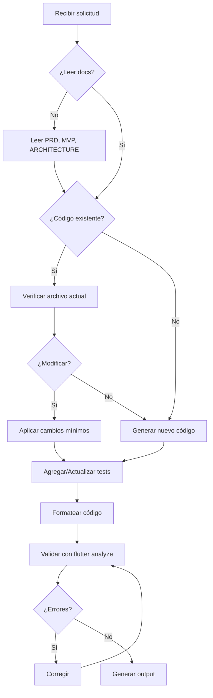
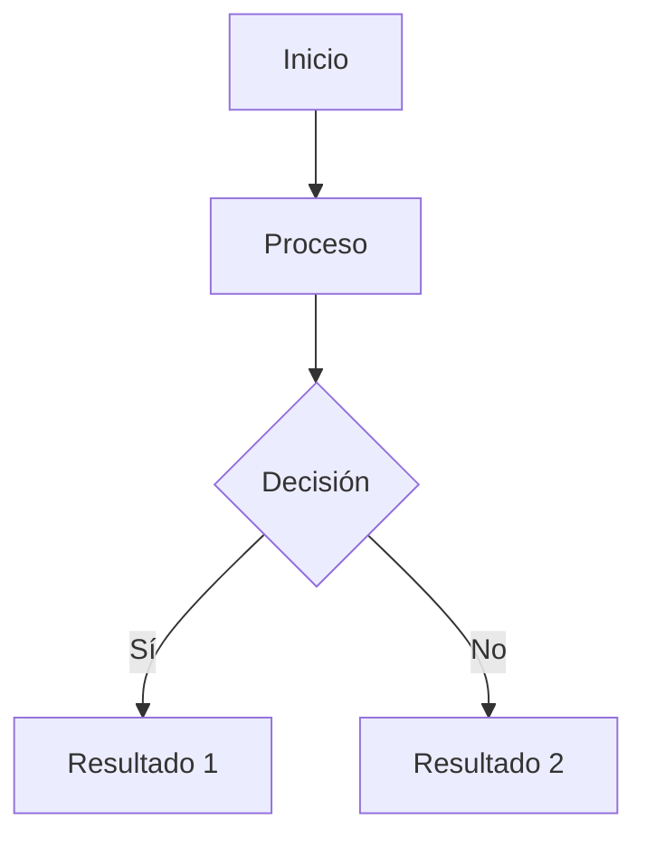

# 🤖 IA_RULES.md — Directrices para Agentes de Desarrollo IA

**Versión:** 1.0  
**Fecha:** 2025-11-11  
**Autor:** JuanPMorales  
**Propósito:** Definir reglas estrictas para IAs que generen, modifiquen o documenten código del proyecto Task Timer.

---

## 📑 Tabla de Contenidos

1. [Propósito](#1-propósito)
2. [Contexto del Proyecto](#2-contexto-del-proyecto)
3. [Documentos de Referencia Obligatorios](#3-documentos-de-referencia-obligatorios)
4. [Principios Técnicos](#4-principios-técnicos)
5. [Arquitectura y Estructura](#5-arquitectura-y-estructura)
6. [Estilo y Convenciones de Código](#6-estilo-y-convenciones-de-código)
7. [Testing y Calidad](#7-testing-y-calidad)
8. [Gestión de Dependencias](#8-gestión-de-dependencias)
9. [Comportamiento de la IA](#9-comportamiento-de-la-ia)
10. [Limitaciones de la IA](#10-limitaciones-de-la-ia)
11. [Formato de Salida Esperado](#11-formato-de-salida-esperado)
12. [Flujo de Trabajo](#12-flujo-de-trabajo)
13. [Manejo de Errores y Excepciones](#13-manejo-de-errores-y-excepciones)
14. [Seguridad y Privacidad](#14-seguridad-y-privacidad)
15. [Versionado y Commits](#15-versionado-y-commits)
16. [Preguntas Frecuentes](#16-preguntas-frecuentes)
17. [Mantenimiento](#17-mantenimiento)

---

## 1. Propósito

Estas reglas definen los principios que **toda inteligencia artificial** debe seguir al generar, modificar o documentar código del proyecto **Task Timer**.

**Objetivos:**
- ✅ Mantener consistencia arquitectónica
- ✅ Garantizar calidad de código
- ✅ Facilitar mantenibilidad
- ✅ Asegurar adherencia al PRD y MVP
- ✅ Reducir deuda técnica

---

## 2. Contexto del Proyecto

### 2.1 Información General

| Aspecto | Valor |
|---------|-------|
| **Nombre** | Task Timer |
| **Plataformas** | Android (8.0+) / iOS (15+) |
| **Framework** | Flutter 3.19+ |
| **Lenguaje** | Dart 3.3+ |
| **Arquitectura** | Clean Architecture + MVVM + Riverpod |
| **Persistencia** | SQLite (sqflite) |
| **Conectividad** | **Offline-first** (sin backend) |
| **Hardware** | Botones de volumen, vibración |

### 2.2 Características Clave

- **Timer basado en timestamps** (no Timer.periodic persistente)
- **Background support** (Foreground Service en Android)
- **Control físico** (Vol↑ = Start/Resume, Vol↓ = Pause)
- **Dark mode** por defecto (paleta azul #0A0E2A + #3BCDFE)
- **100% local** (sin analytics, sin tracking)

---

## 3. Documentos de Referencia Obligatorios

**CRÍTICO:** La IA **DEBE** leer estos documentos antes de generar código:

| Documento | Ruta | Propósito |
|-----------|------|-----------|
| **PRD** | `./task_timer_prd_v2.md` | Requerimientos del producto |
| **MVP Técnico** | `./task_timer_mvp_tecnico.md` | Alcance técnico del MVP |
| **Arquitectura** | `./ARCHITECTURE.md` | Diseño técnico detallado |
| **README** | `./README.md` | Instrucciones generales |
| **CHANGELOG** | `./CHANGELOG.md` | Historial de cambios |

### 3.1 Prioridad de Documentos

En caso de conflicto entre documentos:

```
ARCHITECTURE.md > MVP_TECNICO.md > PRD.md > README.md
```

**Ejemplo:** Si el PRD dice "usar Provider" pero ARCHITECTURE.md dice "usar Riverpod", seguir ARCHITECTURE.md.

---

## 4. Principios Técnicos

### 4.1 Principios SOLID

| Principio | Aplicación en Task Timer |
|-----------|--------------------------|
| **Single Responsibility** | Cada clase tiene una única razón de cambio |
| **Open/Closed** | Extender funcionalidad sin modificar código existente |
| **Liskov Substitution** | Subtipos deben ser intercambiables |
| **Interface Segregation** | Interfaces específicas, no genéricas |
| **Dependency Inversion** | Dependencias de abstracciones, no implementaciones |

### 4.2 Reglas de Arquitectura

#### ❌ Prohibido

```dart
// MAL: Presentation depende de Data directamente
class TimerScreen extends StatelessWidget {
  final DatabaseHelper _db = DatabaseHelper.instance; // ❌
}

// MAL: Domain depende de Framework
import 'package:flutter/material.dart'; // ❌ en domain/
class Task {
  final Color color; // ❌
}

// MAL: UI con lógica de negocio
class TaskListScreen extends StatelessWidget {
  void createTask() {
    final db = await openDatabase(...); // ❌
    await db.insert('tasks', ...);
  }
}
```

#### ✅ Correcto

```dart
// BIEN: Presentation depende de Domain
class TimerScreen extends ConsumerWidget {
  @override
  Widget build(BuildContext context, WidgetRef ref) {
    final timerNotifier = ref.watch(timerProvider.notifier); // ✅
    return ...;
  }
}

// BIEN: Domain sin dependencias externas
class Task {
  final String color; // ✅ String, no Color
}

// BIEN: UI delega a Provider → UseCase → Repository
class TaskListScreen extends ConsumerWidget {
  void createTask() {
    ref.read(taskProvider.notifier).createTask(...); // ✅
  }
}
```

### 4.3 Separación de Capas

**REGLA ESTRICTA:** Las capas solo pueden depender de capas inferiores o del mismo nivel.

```
┌─────────────┐
│ Presentation│  ← Puede usar Domain
└──────┬──────┘
       ↓
┌──────────────┐
│   Domain     │  ← NO puede usar Data ni Presentation
└──────┬───────┘
       ↓
┌──────────────┐
│    Data      │  ← Puede usar Domain
└──────────────┘
```

---

## 5. Arquitectura y Estructura

### 5.1 Estructura de Carpetas (OBLIGATORIA)

```
lib/
├── core/
│   ├── theme/
│   │   ├── colors.dart
│   │   └── text_styles.dart
│   ├── constants/
│   │   └── app_constants.dart
│   ├── utils/
│   │   ├── logger.dart
│   │   ├── validators.dart
│   │   └── performance_tracker.dart
│   └── providers/
│       └── providers.dart
│
├── data/
│   ├── models/
│   │   ├── task_model.dart
│   │   └── timer_session_model.dart
│   ├── repositories/
│   │   ├── task_repository_impl.dart
│   │   └── timer_repository_impl.dart
│   └── database/
│       ├── database_helper.dart
│       └── migrations.dart
│
├── domain/
│   ├── entities/
│   │   ├── task.dart
│   │   └── timer_session.dart
│   ├── repositories/
│   │   ├── task_repository.dart
│   │   └── timer_repository.dart
│   └── usecases/
│       ├── create_task.dart
│       ├── get_tasks.dart
│       ├── start_timer.dart
│       ├── pause_timer.dart
│       └── restore_timer.dart
│
├── presentation/
│   ├── providers/
│   │   ├── task_provider.dart
│   │   └── timer_provider.dart
│   ├── screens/
│   │   ├── task_list_screen.dart
│   │   └── timer_screen.dart
│   └── widgets/
│       ├── task_card.dart
│       ├── circular_progress.dart
│       └── new_task_modal.dart
│
├── services/
│   ├── volume_button_service.dart
│   ├── vibration_service.dart
│   └── background_service.dart
│
└── main.dart
```

### 5.2 Reglas de Naming

#### Archivos

```dart
// ✅ BIEN: snake_case para archivos
task_repository.dart
timer_provider.dart
create_task.dart

// ❌ MAL: PascalCase o camelCase
TaskRepository.dart  // ❌
timerProvider.dart   // ❌
```

#### Clases

```dart
// ✅ BIEN: PascalCase para clases
class TaskRepository { }
class TimerProvider { }
class CreateTaskUseCase { }

// ❌ MAL: snake_case o camelCase
class task_repository { } // ❌
class timerProvider { }   // ❌
```

#### Variables y Métodos

```dart
// ✅ BIEN: camelCase
final remainingSeconds = 60;
void startTimer() { }

// ❌ MAL: snake_case o PascalCase
final remaining_seconds = 60; // ❌
void StartTimer() { }         // ❌
```

#### Constantes

```dart
// ✅ BIEN: camelCase para constantes privadas
const _databaseVersion = 1;
const _cacheDuration = Duration(minutes: 5);

// ✅ BIEN: lowerCamelCase para constantes públicas
const defaultColor = '#3BCDFE';
const maxTaskNameLength = 50;

// ❌ MAL: SCREAMING_SNAKE_CASE (solo para enums)
const DATABASE_VERSION = 1; // ❌
```

#### Enums

```dart
// ✅ BIEN: PascalCase para enum, lowerCamelCase para valores
enum TimerStatus {
  stopped,
  running,
  paused,
  completed,
}

// ❌ MAL: SCREAMING_SNAKE_CASE
enum TimerStatus {
  STOPPED,  // ❌
  RUNNING,  // ❌
}
```

---

## 6. Estilo y Convenciones de Código

### 6.1 Formato

**REGLA:** Todo código debe pasar `flutter format` sin cambios.

```bash
# Antes de commit
flutter format lib/ test/

# Verificar (falla si hay cambios necesarios)
flutter format --set-exit-if-changed lib/ test/
```

### 6.2 Imports

**Orden de imports:**

```dart
// 1. Dart SDK
import 'dart:async';
import 'dart:io';

// 2. Paquetes externos (Flutter, packages)
import 'package:flutter/material.dart';
import 'package:flutter_riverpod/flutter_riverpod.dart';

// 3. Imports del proyecto (absolutos)
import 'package:task_timer/core/utils/logger.dart';
import 'package:task_timer/domain/entities/task.dart';

// 4. Imports relativos (solo si es necesario)
import '../widgets/task_card.dart';
```

**PROHIBIDO:** Mezclar imports absolutos y relativos sin razón.

### 6.3 Documentación

**OBLIGATORIO:** Documentar todas las clases, métodos y funciones públicas.

```dart
/// Repositorio para gestionar las operaciones CRUD de tareas.
///
/// Implementa [TaskRepository] y usa SQLite como fuente de datos.
/// Incluye caché en memoria para optimizar lecturas frecuentes.
///
/// Ejemplo de uso:
/// ```dart
/// final repo = TaskRepositoryImpl(DatabaseHelper.instance);
/// final tasks = await repo.getAll();
/// ```
class TaskRepositoryImpl implements TaskRepository {
  /// Crea una nueva tarea en la base de datos.
  ///
  /// Lanza [ValidationException] si los datos son inválidos.
  /// Lanza [DatabaseException] si hay error de persistencia.
  ///
  /// Parámetros:
  /// - [task]: La tarea a crear (debe tener ID único)
  @override
  Future<void> create(Task task) async {
    // Implementación...
  }
}
```

### 6.4 Comentarios

```dart
// ✅ BIEN: Comentarios explicativos cuando necesario
// Calcular tiempo transcurrido usando timestamps absolutos
// para robustez frente a kills de proceso
final elapsed = DateTime.now().difference(startTime).inSeconds;

// ❌ MAL: Comentarios obvios
// Incrementar contador
counter++; // ❌

// ❌ MAL: Código comentado (usar git history)
// final oldLogic = someOldCode(); // ❌
```

### 6.5 Longitud de Línea

**REGLA:** Máximo 80 caracteres por línea (Flutter estándar).

```dart
// ✅ BIEN
final task = Task(
  id: uuid.v4(),
  name: name,
  durationSeconds: duration,
);

// ❌ MAL: Línea muy larga
final task = Task(id: uuid.v4(), name: name, durationSeconds: duration, color: color, createdAt: DateTime.now());
```

---

## 7. Testing y Calidad

### 7.1 Cobertura Mínima

**OBLIGATORIO:** Cobertura ≥70% en el MVP.

| Tipo de Test | Cobertura Mínima | Ubicación |
|--------------|------------------|-----------|
| **Unit Tests** | 80% | `test/` |
| **Widget Tests** | 60% | `test/` |
| **Integration Tests** | 50% | `integration_test/` |

### 7.2 Estructura de Tests

```
test/
├── core/
│   └── utils/
│       └── validators_test.dart
├── data/
│   └── repositories/
│       └── task_repository_test.dart
├── domain/
│   └── usecases/
│       └── create_task_test.dart
├── presentation/
│   └── providers/
│       └── task_provider_test.dart
└── helpers/
    └── task_builder.dart

integration_test/
└── app_test.dart
```

### 7.3 Naming de Tests

```dart
// ✅ BIEN: Descripción clara de lo que se prueba
test('createTask lanza ValidationException si nombre está vacío', () { });
test('getAll retorna lista ordenada por created_at DESC', () { });
test('Timer decrementa cada segundo correctamente', () { });

// ❌ MAL: Descripciones vagas
test('test 1', () { }); // ❌
test('funciona', () { }); // ❌
```

### 7.4 Arrange-Act-Assert

```dart
test('createTask guarda correctamente en DB', () async {
  // Arrange (preparar)
  final mockDb = MockDatabaseHelper();
  final repository = TaskRepositoryImpl(mockDb);
  final task = TaskBuilder().build();
  
  when(mockDb.insert(any, any)).thenAnswer((_) async => 1);
  
  // Act (ejecutar)
  await repository.create(task);
  
  // Assert (verificar)
  verify(mockDb.insert('tasks', any)).called(1);
});
```

### 7.5 Tests Obligatorios por Sprint

**Sprint 2 (DB + CRUD):**
- [ ] `TaskRepository.create()` con datos válidos
- [ ] `TaskRepository.create()` con nombre vacío (lanza excepción)
- [ ] `TaskRepository.getAll()` retorna lista ordenada
- [ ] `TaskRepository.update()` modifica correctamente
- [ ] `TaskRepository.delete()` elimina de DB

**Sprint 3 (Timer):**
- [ ] `TimerProvider.start()` crea sesión en DB
- [ ] `TimerProvider._startTicker()` decrementa cada segundo
- [ ] `TimerProvider.pause()` guarda progreso
- [ ] `TimerProvider.restore()` calcula tiempo correcto

**Sprint 5 (Background):**
- [ ] Integration test: cerrar app → reabrir → timer se restaura
- [ ] Timer basado en timestamps es inmune a cambios de hora del sistema

---

## 8. Gestión de Dependencias

### 8.1 Dependencias Permitidas

**SOLO las listadas en el PRD y MVP:**

```yaml
dependencies:
  flutter:
    sdk: flutter
  flutter_riverpod: ^2.4.10
  sqflite: ^2.3.2
  path_provider: ^2.1.2
  path: ^1.8.3
  volume_controller: ^2.0.7
  vibration: ^1.8.4
  intl: ^0.19.0
  uuid: ^4.3.3

dev_dependencies:
  flutter_test:
    sdk: flutter
  flutter_lints: ^3.0.1
  mockito: ^5.4.4
  build_runner: ^2.4.8
```

### 8.2 Prohibido Agregar Sin Aprobación

❌ **NO agregar:**
- `provider` (usar Riverpod)
- `bloc` / `flutter_bloc` (usar Riverpod)
- `get_it` (usar Riverpod providers)
- `hive` / `shared_preferences` (usar SQLite)
- `firebase_*` (MVP es offline)
- `dio` / `http` (no hay backend)

### 8.3 Proceso para Nueva Dependencia

Si la IA detecta necesidad de nueva dependencia:

1. **Pausar generación de código**
2. **Crear issue en GitHub:**
   ```markdown
   ## Nueva Dependencia Propuesta
   
   **Paquete:** `package_name`
   **Versión:** `^X.Y.Z`
   **Razón:** [Explicar por qué es necesaria]
   **Alternativas evaluadas:** [Listar alternativas consideradas]
   **Impacto:** [En tamaño de APK, performance, etc.]
   ```
3. **Esperar aprobación del Product Owner**

---

## 9. Comportamiento de la IA

### 9.1 Flujo de Trabajo



### 9.2 Antes de Generar Código

**CHECKLIST OBLIGATORIO:**

- [ ] Leí `ARCHITECTURE.md`
- [ ] Leí `MVP_TECNICO.md`
- [ ] Verifiqué que el módulo no existe
- [ ] Identifiqué la capa correcta (presentation/domain/data)
- [ ] Verifiqué dependencias permitidas
- [ ] Planifiqué los tests necesarios

### 9.3 Preguntas Antes de Actuar

Si hay **ambigüedad**, la IA debe preguntar:

```markdown
## ⚠️ Necesito Aclaración

**Contexto:** Estoy generando `XYZ`

**Pregunta:** ¿Debo usar [opción A] o [opción B]?

**Opciones:**
1. **Opción A:** [Descripción + pros/cons]
2. **Opción B:** [Descripción + pros/cons]

**Recomendación:** Opción A porque [razón]
```

### 9.4 Modificación de Código Existente

**REGLA:** Aplicar cambios mínimos, no reescribir todo.

```dart
// ❌ MAL: Reescribir método completo
// Antes:
void createTask(String name, int duration) {
  final task = Task(name: name, duration: duration);
  _repository.create(task);
}

// IA reescribe todo: ❌
Future<void> createTask(String name, int duration, String color) async {
  // Cambió toda la firma y agregó async innecesariamente
}

// ✅ BIEN: Cambio mínimo
// Antes:
void createTask(String name, int duration) {
  final task = Task(name: name, duration: duration);
  _repository.create(task);
}

// IA agrega solo el parámetro: ✅
void createTask(String name, int duration, String color) {
  final task = Task(name: name, duration: duration, color: color);
  _repository.create(task);
}
```

### 9.5 Registro de Decisiones

Si la IA toma una decisión técnica importante, debe **documentarla**:

```markdown
// lib/data/repositories/task_repository_impl.dart

/// Implementación del repositorio de tareas con SQLite.
///
/// **Decisión Técnica:** Se usa caché en memoria con TTL de 5 minutos
/// para reducir queries repetitivos. Justificación: En pruebas de
/// performance, las queries tomaban 150ms con 100 tareas, afectando
/// la fluidez del scroll. Con caché, se redujo a <10ms.
///
/// Fecha: 2025-11-11
/// Issue: #42
class TaskRepositoryImpl implements TaskRepository {
  // ...
}
```

---

## 10. Limitaciones de la IA

### 10.1 Prohibiciones Absolutas

❌ **La IA NO puede:**

1. **Modificar archivos del sistema** sin aprobación explícita:
   - `README.md`
   - `LICENSE`
   - `.github/workflows/*`
   - `pubspec.yaml` (excepto comentarios)
   - `.gitignore`

2. **Acceder a servicios externos:**
   - APIs HTTP/REST
   - Firebase
   - Analytics
   - Crashlytics (en MVP)

3. **Generar contenido no técnico:**
   - Marketing
   - Comunicados de prensa
   - Emails a usuarios

4. **Exponer datos personales:**
   - No hardcodear nombres, emails, teléfonos
   - No incluir tokens o API keys

5. **Crear lógica fuera del alcance del MVP:**
   - Sincronización en la nube
   - Estadísticas avanzadas
   - Modo Pomodoro automático
   - Widgets de pantalla de inicio

### 10.2 Warnings Obligatorios

Si el usuario solicita algo fuera del alcance:

```markdown
⚠️ **Advertencia:** Esta funcionalidad está marcada como "Fuera del Alcance del MVP" en el PRD.

**Solicitado:** [Descripción]
**Roadmap:** Planificado para v1.5 (3-4 meses post-lanzamiento)

**Opciones:**
1. Continuar de todos modos (no recomendado)
2. Crear issue para v1.5
3. Cancelar solicitud

¿Cómo deseas proceder?
```

---

## 11. Formato de Salida Esperado

### 11.1 Archivos Dart

```dart
// ✅ Formato correcto

// 1. Header con copyright (opcional)
// Copyright (c) 2025 JuanPMorales. MIT License.

// 2. Imports ordenados
import 'dart:async';

import 'package:flutter/material.dart';
import 'package:flutter_riverpod/flutter_riverpod.dart';

import 'package:task_timer/domain/entities/task.dart';

// 3. Documentación de clase
/// Descripción de la clase.
class MyClass {
  // 4. Constantes privadas
  static const _constantName = 'value';
  
  // 5. Campos privados
  final String _fieldName;
  
  // 6. Constructor
  const MyClass(this._fieldName);
  
  // 7. Métodos públicos
  void publicMethod() { }
  
  // 8. Métodos privados
  void _privateMethod() { }
}
```

### 11.2 Archivos Markdown

```markdown
# Título Principal

**Metadatos:**
- Fecha: YYYY-MM-DD
- Autor: Nombre

## Sección

### Subsección

Párrafo con **negrita** y *cursiva*.

#### Lista

- Punto 1
- Punto 2
  - Sub-punto

#### Código

```dart
final example = 'code';
```

#### Tabla

| Columna 1 | Columna 2 |
|-----------|-----------|
| Valor 1   | Valor 2   |
```

### 11.3 Diagramas Mermaid

```markdown

```

---

## 12. Flujo de Trabajo

### 12.1 Generar Nuevo Módulo

**Ejemplo: Crear `UpdateTaskUseCase`**

**Paso 1:** Verificar documentación
```markdown
- ✅ Leído ARCHITECTURE.md sección 4.2.2 (UseCases)
- ✅ Verificado que UpdateTaskUseCase no existe
- ✅ Identificado que va en `lib/domain/usecases/update_task.dart`
```

**Paso 2:** Generar código

```dart
// lib/domain/usecases/update_task.dart

import 'package:task_timer/core/utils/logger.dart';
import 'package:task_timer/core/utils/validators.dart';
import 'package:task_timer/domain/entities/task.dart';
import 'package:task_timer/domain/repositories/task_repository.dart';

/// Use case para actualizar una tarea existente.
///
/// Valida los datos antes de persistir y actualiza el campo `updatedAt`.
class UpdateTaskUseCase {
  final TaskRepository _repository;
  
  const UpdateTaskUseCase(this._repository);
  
  /// Ejecuta la actualización de la tarea.
  ///
  /// Lanza [ValidationException] si los datos son inválidos.
  /// Lanza [DatabaseException] si hay error de persistencia.
  Future<void> execute(Task task) async {
    // Validar nombre
    final nameError = TaskValidators.validateName(task.name);
    if (nameError != null) {
      throw ValidationException(nameError);
    }
    
    // Validar duración
    final durationError = TaskValidators.validateDuration(task.durationSeconds);
    if (durationError != null) {
      throw ValidationException(durationError);
    }
    
    // Actualizar timestamp
    final updatedTask = task.copyWith(updatedAt: DateTime.now());
    
    // Persistir
    await _repository.update(updatedTask);
    
    Logger.i('Task updated: ${task.id}');
  }
}
```

**Paso 3:** Generar tests

```dart
// test/domain/usecases/update_task_test.dart

import 'package:flutter_test/flutter_test.dart';
import 'package:mockito/mockito.dart';
import 'package:task_timer/domain/usecases/update_task.dart';

import '../../helpers/task_builder.dart';
import '../../mocks.mocks.dart';

void main() {
  late UpdateTaskUseCase useCase;
  late MockTaskRepository mockRepository;
  
  setUp(() {
    mockRepository = MockTaskRepository();
    useCase = UpdateTaskUseCase(mockRepository);
  });
  
  group('UpdateTaskUseCase -', () {
    test('actualiza tarea correctamente', () async {
      // Arrange
      final task = TaskBuilder().build();
      when(mockRepository.update(any)).thenAnswer((_) async => {});
      
      // Act
      await useCase.execute(task);
      
      // Assert
      verify(mockRepository.update(any)).called(1);
    });
    
    test('lanza ValidationException si nombre vacío', () async {
      // Arrange
      final task = TaskBuilder().withName('').build();
      
      // Act & Assert
      expect(
        () => useCase.execute(task),
        throwsA(isA<ValidationException>()),
      );
    });
  });
}
```

**Paso 4:** Actualizar provider (si necesario)

```dart
// lib/core/providers/providers.dart

final updateTaskUseCaseProvider = Provider<UpdateTaskUseCase>((ref) {
  return UpdateTaskUseCase(ref.watch(taskRepositoryProvider));
});
```

**Paso 5:** Documentar

```markdown
## Changelog

### 2025-11-11
- Agregado `UpdateTaskUseCase` para actualizar tareas
- Tests unitarios con cobertura 100%
- Integrado en `TaskProvider`
```

### 12.2 Modificar Módulo Existente

**Ejemplo: Agregar campo `tags` a Task**

**Paso 1:** Evaluar impacto

```markdown
## Análisis de Impacto

**Cambio:** Agregar campo `tags: List<String>` a `Task`

**Archivos afectados:**
- `lib/domain/entities/task.dart` (entity)
- `lib/data/models/task_model.dart` (model)
- `lib/data/database/database_helper.dart` (migración v1 → v2)
- `test/domain/entities/task_test.dart` (tests)
- `test/data/models/task_model_test.dart` (tests)

**Riesgo:** Medio (requiere migración de DB)
```

**Paso 2:** Aplicar cambios

```dart
// 1. Entidad
class Task {
  final String id;
  final String name;
  final List<String> tags; // ← Nuevo campo
  
  const Task({
    required this.id,
    required this.name,
    this.tags = const [], // ← Default vacío
  });
}

// 2. Model
class TaskModel {
  final String tags; // ← JSON string
  
  Task toEntity() {
    return Task(
      id: id,
      name: name,
      tags: tags.isEmpty ? [] : tags.split(','), // ← Parsear
    );
  }
}

// 3. Migración
Future<void> _migrateToV2(Database db) async {
  await db.execute('ALTER TABLE tasks ADD COLUMN tags TEXT DEFAULT ""');
}
```

**Paso 3:** Actualizar tests

```dart
test('Task con tags se serializa correctamente', () {
  final task = Task(
    id: '123',
    name: 'Test',
    tags: ['work', 'urgent'],
  );
  
  final model = TaskModel.fromEntity(task);
  expect(model.tags, 'work,urgent');
});
```

---

## 13. Manejo de Errores y Excepciones

### 13.1 Jerarquía de Excepciones

```dart
// lib/core/exceptions/exceptions.dart

/// Excepción base de la aplicación
abstract class AppException implements Exception {
  final String message;
  final Object? cause;
  
  const AppException(this.message, [this.cause]);
  
  @override
  String toString() => 'AppException: $message';
}

/// Errores de validación de input
class ValidationException extends AppException {
  const ValidationException(super.message);
}

/// Errores de base de datos
class DatabaseException extends AppException {
  const DatabaseException(super.message, [super.cause]);
}

/// Errores de plataforma (permisos, hardware)
class PlatformException extends AppException {
  const PlatformException(super.message, [super.cause]);
}
```

### 13.2 Try-Catch Pattern

```dart
// ✅ BIEN: Capturar específico, loggear, re-lanzar typed exception
Future<void> create(Task task) async {
  try {
    final db = await _db.database;
    await db.insert('tasks', task.toMap());
  } on SqliteException catch (e) {
    Logger.e('SQLite error', e);
    throw DatabaseException('Error al guardar tarea', e);
  } catch (e, stackTrace) {
    Logger.critical('Unexpected error', e, stackTrace);
    throw DatabaseException('Error inesperado', e);
  }
}

// ❌ MAL: Catch genérico sin re-lanzar
Future<void> create(Task task) async {
  try {
    // ...
  } catch (e) {
    print('Error: $e'); // ❌ No usar print
    // ❌ No re-lanza, silencia el error
  }
}
```

### 13.3 Error Handling en UI

```dart
// lib/presentation/screens/task_list_screen.dart

class TaskListScreen extends ConsumerWidget {
  @override
  Widget build(BuildContext context, WidgetRef ref) {
    final state = ref.watch(taskProvider);
    
    // Mostrar error si existe
    if (state.error != null) {
      return Center(
        child: Column(
          mainAxisAlignment: MainAxisAlignment.center,
          children: [
            Icon(Icons.error_outline, size: 48, color: Colors.red),
            SizedBox(height: 16),
            Text(state.error!),
            SizedBox(height: 16),
            ElevatedButton(
              onPressed: () => ref.read(taskProvider.notifier).loadTasks(),
              child: Text('Reintentar'),
            ),
          ],
        ),
      );
    }
    
    // ...
  }
}
```

---

## 14. Seguridad y Privacidad

### 14.1 Datos Sensibles

**PROHIBIDO hardcodear:**

```dart
// ❌ MAL
const apiKey = 'sk-1234567890abcdef'; // ❌
const userEmail = 'juan@example.com'; // ❌
const databasePassword = 'password123'; // ❌
```

### 14.2 SQL Injection Prevention

```dart
// ✅ BIEN: Usar placeholders
await db.query(
  'tasks',
  where: 'id = ?',
  whereArgs: [taskId], // ← Safe
);

// ❌ MAL: Concatenación de strings
await db.rawQuery('SELECT * FROM tasks WHERE id = "$taskId"'); // ❌ Vulnerable
```

### 14.3 Input Sanitization

```dart
// lib/core/utils/validators.dart

class TaskValidators {
  static String sanitizeName(String input) {
    // Remover caracteres peligrosos
    return input
        .replaceAll(RegExp(r'[^\w\s\-áéíóúñÁÉÍÓÚÑ]'), '')
        .trim()
        .substring(0, min(input.length, 50));
  }
  
  static String? validateName(String? value) {
    if (value == null || value.trim().isEmpty) {
      return 'El nombre no puede estar vacío';
    }
    
    final sanitized = sanitizeName(value);
    if (sanitized != value) {
      return 'El nombre contiene caracteres no válidos';
    }
    
    return null;
  }
}
```

---

## 15. Versionado y Commits

### 15.1 Conventional Commits

**Formato:**

```
<type>(<scope>): <description>

[optional body]

[optional footer]
```

**Tipos permitidos:**

| Tipo | Uso |
|------|-----|
| `feat` | Nueva funcionalidad |
| `fix` | Corrección de bug |
| `docs` | Cambios en documentación |
| `style` | Formato (no afecta lógica) |
| `refactor` | Refactorización (no cambia comportamiento) |
| `test` | Agregar o modificar tests |
| `chore` | Mantenimiento (deps, config) |
| `perf` | Mejora de performance |

**Ejemplos:**

```bash
# ✅ BIEN
feat(timer): agregar soporte para pausar con Vol↓
fix(db): corregir migración v1→v2 fallando en Android 8
docs(readme): actualizar instrucciones de instalación
test(repository): agregar tests para TaskRepository.update()
refactor(providers): extraer lógica común a base class

# ❌ MAL
update stuff  # ❌ Vago
fixed bug     # ❌ No especifica qué bug
WIP           # ❌ Work In Progress no debe commitearse
```

### 15.2 Commits de la IA

Cuando la IA genera código, debe sugerir el commit message:

```markdown
## 📝 Código Generado

**Archivos creados:**
- `lib/domain/usecases/update_task.dart`
- `test/domain/usecases/update_task_test.dart`

**Archivos modificados:**
- `lib/core/providers/providers.dart`

**Commit sugerido:**
```bash
feat(usecases): agregar UpdateTaskUseCase

- Implementado use case para actualizar tareas
- Validaciones de nombre y duración
- Tests unitarios con cobertura 100%
- Integrado en TaskProvider
```
```

### 15.3 Workflow Profesional - Feature Branch por Tarea

**REGLA CRÍTICA:** Cada tarea del TASK_BREAKDOWN.md debe completarse en una rama `feature/*` independiente siguiendo [Conventional Commits v1.0.0](https://www.conventionalcommits.org/en/v1.0.0/).

#### 15.3.1 Flujo Completo (Una Tarea a la Vez)

```bash
# === PASO 1: Preparar rama feature ===
git checkout develop
git pull origin develop
git checkout -b feature/<nombre-descriptivo-tarea>

# Ejemplo para tarea 2.1.7:
git checkout -b feature/documentar-arquitectura

# === PASO 2: Implementar UNA SOLA tarea ===
# - Escribir código según especificaciones
# - Seguir principios de Clean Architecture
# - Documentar con DartDoc
# - Respetar convenciones de naming

# === PASO 3: Validar código ===
flutter analyze                    # Debe retornar 0 errores
flutter test                       # Todos los tests deben pasar
flutter format lib/ test/          # Formatear código

# === PASO 4: Crear documentación de progreso ===
# Crear archivo: docs/progress/<id>_<nombre>.md
# Ejemplo: docs/progress/2.1.7_documentar_arquitectura.md
# Incluir:
# - Resumen de lo implementado
# - Archivos creados/modificados
# - Decisiones técnicas
# - Validaciones realizadas
# - Próximos pasos

# === PASO 5: Actualizar TASK_BREAKDOWN.md ===
# Cambiar estado de tarea a: ✅ Completada

# === PASO 6: Commit con Conventional Commits ===
git add .
git commit -m "feat(core): document Clean Architecture design

Completa tarea 2.1.7 del TASK_BREAKDOWN.md

- Agrega diagramas de capas (Domain, Data, Presentation)
- Documenta flujo de datos con Riverpod
- Incluye ejemplos de dependencias entre capas
- Actualiza ARCHITECTURE.md con secciones completas

Refs: TASK_BREAKDOWN.md#2.1.7"

# === PASO 7: Push a feature branch ===
git push -u origin feature/documentar-arquitectura

# === PASO 8: Crear Pull Request ===
# En GitHub:
# - Base: develop
# - Compare: feature/documentar-arquitectura
# - Título: "feat(core): document Clean Architecture design"
# - Descripción: Copiar cuerpo del commit
# - Labels: documentation, task-2.1.7
# - Assignee: Desarrollador

# === PASO 9: Code Review y Merge ===
# - CI/CD debe pasar (tests, lint)
# - Revisión de código (opcional si es individual)
# - Mergear con "Squash and merge"
# - Eliminar rama feature después de merge

# === PASO 10: Actualizar local y siguiente tarea ===
git checkout develop
git pull origin develop
# Repetir desde PASO 1 para la siguiente tarea
```

#### 15.3.2 Naming de Feature Branches

**Formato:** `feature/<nombre-kebab-case>`

```bash
# ✅ BIEN - Descriptivos y concisos
feature/task-creation-modal
feature/timer-background-service
feature/volume-button-control
feature/documentar-arquitectura
feature/configure-riverpod

# ❌ MAL - Demasiado genéricos o incorrectos
feature/new-stuff              # ❌ Vago
feature_timer                  # ❌ Guion bajo
FEATURE/timer                  # ❌ Mayúsculas
timer-feature                  # ❌ Orden invertido
feature/2.1.7                  # ❌ Solo número de tarea
```

#### 15.3.3 Formato de Commit con Conventional Commits

**Especificación:** [conventionalcommits.org/en/v1.0.0](https://www.conventionalcommits.org/en/v1.0.0/)

```
<type>(<scope>): <description>

[optional body]

[optional footer(s)]
```

**Tipos obligatorios:**

| Tipo | Uso | Ejemplo |
|------|-----|---------|
| `feat` | Nueva funcionalidad | `feat(task): add creation modal` |
| `fix` | Corrección de bug | `fix(timer): resolve pause race condition` |
| `docs` | Solo documentación | `docs(architecture): add diagrams` |
| `style` | Formato (sin cambio lógica) | `style(task): format code with dartfmt` |
| `refactor` | Refactor (sin cambio comportamiento) | `refactor(db): simplify query builder` |
| `test` | Tests | `test(timer): add unit tests for pause` |
| `chore` | Mantenimiento | `chore(deps): update riverpod to 2.5.0` |
| `perf` | Performance | `perf(db): add index on created_at` |
| `ci` | CI/CD | `ci(github): add flutter analyze step` |
| `build` | Build system | `build(gradle): update Android SDK` |

**Breaking Changes:**

```bash
# Con !
feat(api)!: change Task.duration to int

BREAKING CHANGE: Task.duration now expects seconds as int instead of String

# Migración:
# Antes: Task(duration: "30:00")
# Ahora: Task(durationSeconds: 1800)
```

**Ejemplos completos:**

```bash
# Feature con scope y descripción
feat(task): add name validation in creation modal

Validates task name with following rules:
- Minimum 1 character
- Maximum 50 characters
- No leading/trailing whitespace
- Only alphanumeric and spaces allowed

Refs: TASK_BREAKDOWN.md#3.1.6

# Fix con issue reference
fix(timer): prevent negative elapsed time on clock change

The timer could show negative values when system clock changed
(airplane mode, timezone switch). Now using Stopwatch for
monotonic time measurement.

Fixes #42

# Documentación
docs(progress): complete task 2.1.7 documentation

Adds comprehensive architecture documentation including:
- Clean Architecture layer diagrams
- Data flow examples with Riverpod
- Dependency injection patterns
- Testing strategies per layer

# Múltiples tipos en un commit (NO RECOMENDADO - dividir)
# ❌ MAL
feat(task): add modal and fix validation bug

# ✅ BIEN (2 commits separados)
feat(task): add creation modal
fix(task): validate name length correctly
```

#### 15.3.4 Commits Atómicos

**REGLA:** Un commit = Un cambio lógico coherente.

```bash
# ✅ BIEN - Commits atómicos
git commit -m "feat(task): add Task entity"
git commit -m "feat(task): add TaskModel for SQLite"
git commit -m "feat(task): implement TaskRepository interface"
git commit -m "test(task): add unit tests for TaskRepository"

# ❌ MAL - Commit gigante
git commit -m "feat(task): complete task module

- Add entity
- Add model
- Add repository
- Add use cases
- Add tests
- Add UI"  # ← Demasiado grande, dividir en 6+ commits
```

#### 15.3.5 Documentación por Tarea

**Archivo obligatorio:** `docs/progress/<id>_<nombre>.md`

**Template:**

```markdown
# <ID> - <Nombre de Tarea>

**Estado:** ✅ Completada  
**Fecha:** YYYY-MM-DD  
**Rama:** feature/<nombre>  
**Commit:** <hash>

---

## 📋 Resumen

Breve descripción de lo implementado (2-3 líneas).

---

## ✅ Tareas Completadas

- [x] Subtarea 1
- [x] Subtarea 2
- [x] Subtarea 3

---

## 📁 Archivos Creados

- `lib/path/file1.dart` - Descripción
- `test/path/file1_test.dart` - Tests unitarios

---

## 🔧 Archivos Modificados

- `lib/core/providers.dart` - Agregado provider X
- `docs/TASK_BREAKDOWN.md` - Actualizado estado

---

## 🧪 Validaciones

```bash
flutter analyze  # ✅ 0 issues
flutter test     # ✅ 15/15 tests passed
```

---

## 📝 Decisiones Técnicas

- **Decisión 1:** Razón
- **Decisión 2:** Razón

---

## 🔗 Referencias

- TASK_BREAKDOWN.md#<id>
- Conventional Commits: https://www.conventionalcommits.org/
- Commits: <hash>

---

## ➡️ Próximos Pasos

- Tarea <id+1>: <nombre>
```

#### 15.3.6 Actualización de TASK_BREAKDOWN.md

Después de cada tarea:

```markdown
| 2.1.7 | Documentar arquitectura en docs/ARCHITECTURE.md | ✅ Completada | 2.1.6 |
```

Commit:

```bash
git add docs/TASK_BREAKDOWN.md
git commit -m "docs(breakdown): mark task 2.1.7 as completed"
```

#### 15.3.7 Protección de Ramas

**Configuración de GitHub:**

- `main`: Requiere PR + CI pass (no push directo)
- `develop`: Acepta push directo o PR
- `feature/*`: Push directo permitido

**Flujo de merge:**

```
feature/xyz → develop (via PR o push)
develop → main (via PR reviewed)
```

---

## 16. Preguntas Frecuentes

### Q1: ¿Puedo usar `print()` para debugging?

**R:** ❌ **NO.** Usa `Logger` de `lib/core/utils/logger.dart`.

```dart
// ❌ MAL
print('Task created: $taskId');

// ✅ BIEN
Logger.i('Task created: $taskId');
```

### Q2: ¿Cuándo usar `const` vs `final`?

**R:**
- `const`: Valores conocidos en compile-time
- `final`: Valores conocidos en runtime pero inmutables

```dart
// ✅ const (compile-time)
const maxLength = 50;
const defaultColor = '#3BCDFE';

// ✅ final (runtime)
final now = DateTime.now();
final uuid = Uuid().v4();
```

### Q3: ¿Debo usar `async`/`await` siempre?

**R:** ❌ **NO.** Solo si hay operaciones asíncronas.

```dart
// ❌ MAL: async innecesario
Future<int> calculate() async {
  return 2 + 2; // ← Operación síncrona
}

// ✅ BIEN: sin async
int calculate() {
  return 2 + 2;
}

// ✅ BIEN: async necesario
Future<List<Task>> getTasks() async {
  final db = await _db.database; // ← Operación asíncrona
  final maps = await db.query('tasks');
  return maps.map((m) => TaskModel.fromMap(m).toEntity()).toList();
}
```

### Q4: ¿Cómo nombro variables booleanas?

**R:** Usar prefijos `is`, `has`, `can`, `should`.

```dart
// ✅ BIEN
final isArchived = true;
final hasError = false;
final canStart = true;
final shouldVibrate = false;

// ❌ MAL
final archived = true;     // ❌ No es claro que es boolean
final error = false;       // ❌ Parece nullable
```

### Q5: ¿Puedo modificar `pubspec.yaml`?

**R:** ⚠️ **Solo comentarios.** Para agregar dependencias, crear issue.

```yaml
# ✅ BIEN: Agregar comentario
dependencies:
  flutter:
    sdk: flutter
  # State management
  flutter_riverpod: ^2.4.10

# ❌ MAL: Agregar dependencia sin aprobación
dependencies:
  get_it: ^7.6.0  # ❌
```

### Q6: ¿Qué hacer si `flutter analyze` falla?

**R:** Corregir todos los errores antes de generar output.

```bash
# Ejecutar análisis
flutter analyze

# Si hay errores, corregirlos y re-analizar
flutter analyze

# Output esperado:
# No issues found! (ran in 2.3s)
```

### Q7: ¿Cómo manejo nullable types?

**R:** Ser explícito con `?` y manejar nulls correctamente.

```dart
// ✅ BIEN: Nullable explícito
String? getName() {
  return _name;
}

// Verificar null antes de usar
final name = getName();
if (name != null) {
  print(name.toUpperCase()); // Safe
}

// O usar operador ??
final displayName = getName() ?? 'Sin nombre';

// ❌ MAL: Forzar no-null sin verificar
final name = getName();
print(name!.toUpperCase()); // ❌ Puede crashear
```

### Q8: ¿Debo crear archivo nuevo o modificar existente?

**R:** Seguir esta lógica:

```
¿El módulo ya existe?
├─ Sí → Modificar existente (cambios mínimos)
└─ No → Crear nuevo archivo
```

---

## 17. Mantenimiento

### 17.1 Actualización de este Documento

**Este archivo debe actualizarse cuando:**

- ✅ Se modifica `ARCHITECTURE.md`
- ✅ Se modifica `PRD.md` o `MVP_TECNICO.md`
- ✅ Se agregan nuevas reglas de estilo
- ✅ Se identifican patrones recurrentes de errores
- ✅ Se agregan nuevas dependencias aprobadas

### 17.2 Historial de Cambios

| Fecha | Versión | Cambios |
|-------|---------|---------|
| 2025-11-11 | 1.0 | Creación inicial del documento |

### 17.3 Responsables

| Rol | Nombre | Responsabilidad |
|-----|--------|-----------------|
| **Product Owner** | JuanPMorales | Aprobar cambios en reglas de negocio |
| **Tech Lead** | JuanPMorales | Aprobar cambios en reglas técnicas |
| **QA Lead** | JuanPMorales | Validar reglas de testing |

### 17.4 Revisión Periódica

**Calendario de revisión:**
- **Sprint 2:** Validar reglas de DB y testing
- **Sprint 4:** Validar reglas de servicios nativos
- **Sprint 6 (Pre-release):** Revisión completa

---

## 📌 Resumen Ejecutivo

### ✅ DO (Hacer)

1. ✅ Leer `ARCHITECTURE.md`, `MVP_TECNICO.md`, `PRD.md` antes de generar código
2. ✅ Seguir Clean Architecture (domain/data/presentation)
3. ✅ Usar Riverpod para gestión de estado
4. ✅ Documentar todas las clases públicas
5. ✅ Escribir tests (cobertura ≥70%)
6. ✅ Usar `Logger` en lugar de `print()`
7. ✅ Validar input del usuario
8. ✅ Manejar errores con try-catch y excepciones tipadas
9. ✅ Usar placeholders en queries SQL
10. ✅ Formatear código con `flutter format`

### ❌ DON'T (No Hacer)

1. ❌ No agregar dependencias sin aprobación
2. ❌ No usar `provider`, `bloc`, o `get_it`
3. ❌ No hardcodear datos sensibles
4. ❌ No usar concatenación de strings en SQL
5. ❌ No modificar `README.md`, `LICENSE`, o workflows sin aprobación
6. ❌ No generar funcionalidades fuera del alcance del MVP
7. ❌ No usar `print()` para logging
8. ❌ No reescribir código completo (cambios mínimos)
9. ❌ No silenciar errores con catch vacíos
10. ❌ No mezclar lógica de negocio en UI

---

**🚀 Última actualización:** 2025-11-11 18:45:24 UTC  
**📧 Contacto:** JuanPMorales  
**📝 Versión:** 1.0  

---

_Este documento es la **fuente de verdad** para todas las IAs que trabajen en Task Timer._  
_Cualquier código generado que no cumpla estas reglas debe ser rechazado._